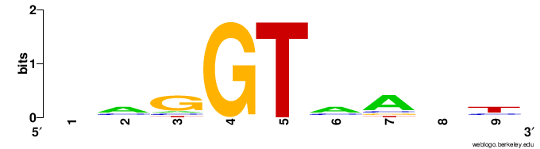

PSSM（Position-Specific Scoring Matrix）是从MSA中构建的，实际上就是相同长度的一组序列根据各个位点氨基酸（碱基）频率计算得到的的**权值矩阵，**是许多motif寻找软件的组成部分。

<!-- more -->

PSSM（Position-Specific Scoring Matrix）是从MSA中构建的，实际上就是相同长度的一组序列根据各个位点氨基酸（碱基）频率计算得到的的**权值矩阵，**是许多motif寻找软件的组成部分。

详细介绍见wiki：[Position weight matrix - Wikipedia](https://en.wikipedia.org/wiki/Position_weight_matrix)

PSSM就是一个打分矩阵，这个分数呢，可以是频数（PFM）、频率(PPM)、也可以是log-odds(PWM)。

## 计算过程解释

其典型计算过程为（以碱基为例）： 

### 1. 计算PFM(Position Frequency Matrix)

从多序列比对MSA中，计算每个位点不同碱基的出现次数

GAGGTAAAC  
TCCGTAAGT  
CAGGTTGGA  
ACAGTCAGT  
TAGGTCATT  
TAGGTACTG  
ATGGTAACT  
CAGGTATAC  
TGTGTGAGT  
AAGGTAAGT

得到PFM：

||1|2|3|4|5|6|7|8|9|
| ---| ---| ---| ---| ----| ----| ---| ---| ---| ---|
|A|3|6|1|0|0|6|7|2|1|
|C|2|2|1|0|0|2|1|1|2|
|G|1|1|7|10|0|1|1|5|1|
|T|4|1|1|0|10|1|1|2|6|

### 2. 基于氨基酸频数计算PPM（Position Probability Matrix）

直接基于频数算频率

* Column 1: $f_{A, 1}=\frac{3}{10}=0.3, f_{C, 1}=\frac{2}{10}=0.2, \ldots$
* Column 2: $f_{A, 2}=\frac{6}{10}=0.6, f_{C, 2}=\frac{2}{10}=0.2, \ldots$
* ...

||1|2|3|4|5|6|7|8|9|
| ---| -----| -----| -----| -----| -----| -----| -----| -----| -----|
|A|0.3|0.6|0.1|0.0|0.0|0.6|0.7|0.2|0.1|
|C|0.2|0.2|0.1|0.0|0.0|0.2|0.1|0.1|0.2|
|G|0.1|0.1|0.7|1.0|0.0|0.1|0.1|0.5|0.1|
|T|0.4|0.1|0.1|0.0|1.0|0.1|0.1|0.2|0.6|

为了解决有些氨基酸类型出现为0的情况，可以给分子、分母增加pseudo-counts：

* Column 1: $f_{A, 1}^{\prime}=\frac{3+1}{10+4}=0.29, f_{C, 1}^{\prime}=\frac{2+1}{10+4}=0.21, \ldots$
* Column 2: $f_{A, 2}^{\prime}=\frac{6+1}{10+4}=0.50, f_{C, 2}^{\prime}=\frac{2+1}{10+4}=0.21, \ldots$
* ...

||1|2|3|4|5|6|7|8|9|
| ---| ------| ------| ------| ------| ------| ------| ------| ------| ------|
|A|0.29|0.50|0.14|0.07|0.07|0.50|0.57|0.21|0.14|
|C|0.21|0.21|0.14|0.07|0.07|0.21|0.14|0.14|0.21|
|G|0.14|0.14|0.57|0.79|0.07|0.14|0.14|0.43|0.14|
|T|0.36|0.14|0.14|0.07|0.79|0.14|0.14|0.21|0.50|

### 3. 计算位点权值矩阵PWM（Position Weight Matrix）

$$
S_{i, j}=\log \frac{f_{i, j}^{\prime}}{P_i}
$$

即前景概率除以背景概率（odds），再用log算权值（log-odds），计算的权值能体现出位点出现该碱基（氨基酸）的优势比。

> [优势、优势比为什么需要log2转换？ (qq.com)](https://mp.weixin.qq.com/s/YHXCog8aThN7l9kp7-cY6g)

$P_i$ 为相应碱基（氨基酸）类型在随机序列中出现的期望频率

* 为了图方便最简单的模型会假设各碱基（氨基酸）出现频率一致，对于氨基酸为 $P_i=\frac{1}{20}=0.05$ ，对于核苷酸为: $P_i=\frac{1}{4}=0.25$
* 实际使用，可以把数据集里的所有序列（不仅仅是motif）的碱基（氨基酸）出现频率手动计算一遍。

这里就简单假设各碱基（氨基酸）出现频率一致

使用单纯频率的PPM，则PWM为

||1|2|3|4|5|6|7|8|9|
| ---| -------| -------| -------| ------| ------| -------| -------| -------| -------|
|A|0.26|1.26|-1.32|-inf|-inf|1.26|1.49|-0.32|-1.32|
|C|-0.32|-0.32|-1.32|-inf|-inf|-0.32|-1.32|-1.32|-0.32|
|G|-1.32|-1.32|1.49|2.0|-inf|-1.32|-1.32|1.00|-1.32|
|T|0.68|-1.32|-1.32|-inf|2.0|-1.32|-1.32|-0.32|1.26|

使用加上pesudo-count的PPM，则PWM为

||1|2|3|4|5|6|7|8|9|
| ---| -------| -------| -------| -------| -------| -------| -------| -------| -------|
|A|0.19|1.00|-0.81|-1.81|-1.81|1.00|1.19|-0.22|-0.81|
|C|-0.22|-0.22|-0.81|-1.81|-1.81|-0.22|-0.81|-0.81|-0.22|
|G|-0.81|-0.81|1.19|1.65|-1.81|-0.81|-0.81|0.78|-0.81|
|T|0.51|-0.81|-0.81|-1.81|1.65|-0.81|-0.81|-0.22|1.00|

> 以上为典型的PSSM计算步骤，但是在具体实践上，不同的软件可能会对细节进行修改，从而得到的PSSM并不一样，如PSI-BLAST会采用BLOSUM62处理pseudo-counts问题。
>
> 另外，PSSM不处理MSA中位点插入和删除的情况。

## 使用Python实现

```python
import pandas as pd
import numpy as np


class PSSM():
    ALPHABET = dict(
        DNA = ['A', 'C', 'G', 'T'],
        RNA = ['A', 'C', 'G', 'U'],
        AA = ['A', 'C', 'D', 'E', 'F', 'G', 'H', 'I', 'K', 'L',
                'M', 'N', 'P', 'Q', 'R', 'S', 'T', 'V', 'W', 'Y']
    )
    def __init__(self, file_path: str, alphabet_type: str) -> None:
        """Initialize PSSM object.
        file_path: path of aln file
        alphabet_type: DNA, RNA, AA
        """
        self.file_path = file_path
        self.alphabet_type = alphabet_type
        self.characters = self.ALPHABET[alphabet_type]

    @property
    def seqs(self) -> list:
        """
        read fasta file and return seq list
        """
        fa_dict = {}
        with open(self.file_path, mode='r', encoding='utf-8') as f:
            for line in f:
                line = line.strip()
                if line.startswith('>'):
                    name = line[1:]
                    fa_dict[name] = ''
                else:
                    fa_dict[name] += line
        return [seq for seq in fa_dict.values()]

    @property
    def seq_length(self) -> int:
        """
        return the width of pssm
        """
        return len(self.seqs[0])

    @property
    def PFM(self) -> np.ndarray:
        """
        return the PFM
        """
        pfm = np.zeros((len(self.characters), self.seq_length), dtype=int)
        for j, seq in enumerate(zip(*self.seqs)):
            for i in range(len(self.characters)):
                pfm[i][j] = seq.count(self.characters[i])
        pfm = pd.DataFrame(pfm, index=self.characters,
                           columns=range(1, self.seq_length+1))
        return pfm

    @property
    def PPM(self) -> np.ndarray:
        """
        return the PPM 
        """
        ppm = (self.PFM+1) / (len(self.seqs)+len(self.characters))
        return round(ppm, 4)

    @property
    def PWM(self) -> np.ndarray:
        """
        return the PWM
        """
        pwm = np.log2(self.PPM / len(self.characters)**(-1))
        return round(pwm, 4)
    @property
    def consensus(self) -> str:
        """
        return the consensus sequence
        """
        consensus = ''
        for j in range(self.seq_length):
            consensus += self.characters[np.argmax(self.PFM.iloc[:, j])]
        return consensus
    @property
    def ic(self) -> float:
        """
        return the information content for each position
        """
        ic = np.sum(self.PWM * self.PPM, axis=0)
        return round(ic, 4)
  
if __name__ == '__main__':
    pssm = PSSM('./input/demo.fa', 'DNA')
    print(pssm.PFM)
    print(pssm.PPM)
    print(pssm.PWM)
    print(pssm.consensus)
    print(pssm.ic)
    # pssm.seqlogo #todo

```

## 画weblogo

[WebLogo - Create Sequence Logos (berkeley.edu)](https://weblogo.berkeley.edu/logo.cgi)

​

‍
