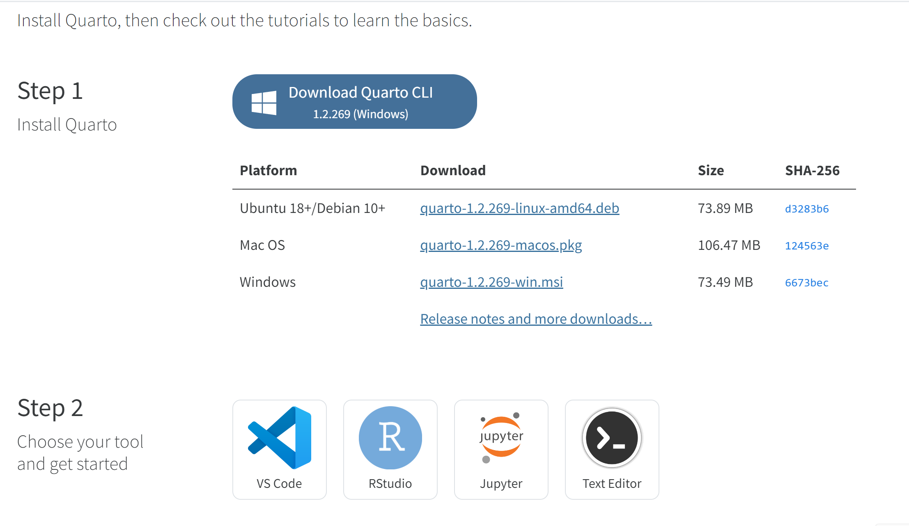
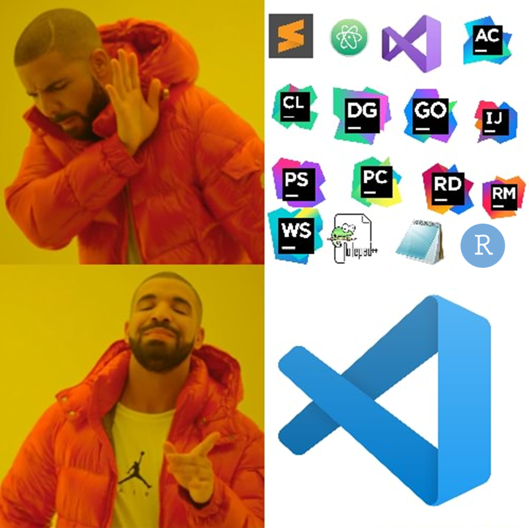
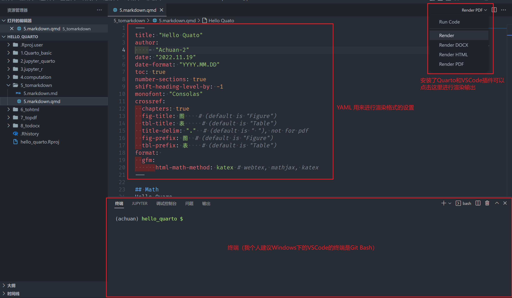
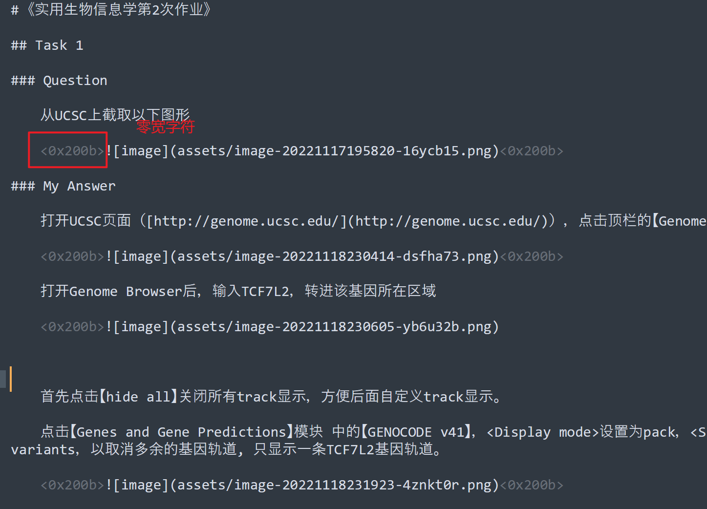

> Quarto 是下一代的 Rmarkdown，相比 Rmarkdown 来说，把生态给大一统了，你甚至不需要有 R 环境也能用，VSCode 上也有专门的[插件](https://marketplace.visualstudio.com/items?itemName=quarto.quarto)。Quarto 的强大之处在于，不仅仅在于可以渲染代码运行结果，而且导出文档方面是我目前见过最无敌的存在，相信我，用上它，你会见到 markdown 的另一片天空。你只需要把 md 改成 qmd 后缀，加上一个 yaml 头，轻轻一点渲染按钮，就可以导出 word、html、ipynb、GFM 规范的 md（还可以设置公式导出为纯文本还是图片），甚至当成简易版的 $\LaTeX$，$\LaTeX$ 代码与 markdown 语法混用，导出样式精美的 pdf。


关联文章：：[设置word模板，Markdown 也能自动转换为美观规范的 Word 文档](https://www.achuan-2.top/posts/bc4b56d9.html)

## 为什么要用 Quarto？

先简单介绍下 Quarto，官网地址 [https://quarto.org/](https://quarto.org/)。

官网是这样介绍的：

> Quarto is an open-source scientific and technical publishing system built on [Pandoc](https://pandoc.org/)
>
> * Create dynamic content with [Python](https://quarto.org/docs/computations/python.html), [R](https://quarto.org/docs/computations/r.html), [Julia](https://quarto.org/docs/computations/julia.html), and [Observable](https://quarto.org/docs/computations/ojs.html).
> * Author documents as plain text markdown or [Jupyter](https://jupyter.org/) notebooks.
> * Publish high-quality articles, reports, presentations, websites, blogs, and books in HTML, PDF, MS Word, ePub, and more.
> * Author with scientific markdown, including equations, citations, crossrefs, figure panels, callouts, advanced layout, and more.

简单来说，Quarto 这个软件可以

* 用来写代码：类似 Jupyter Notebook，可以 Markdown 和代码一起写，并能渲染代码结果到文档里，支持的语言有 Python、R、Julia 和 Observable，能将渲染结果输出为 HTML、PDF、Word 和 GFM Markdown。对于输出为 Markdown，公式还支持直接转换为 [WebTex](https://github.com/KTHse/webtex) 图片，方便发布到其他博客或放入笔记软件里；
* 用来写严肃的报告：相当于pandoc加强版和LaTex简易版，支持导出为PDF、Word，并且支持交叉引用，可以引用图表、引用文献。
* 用来写博客、写书。

  * 写博客的文档：[Quarto - Creating a Website](https://quarto.org/docs/websites/)；
  * 写书的文档：[Quarto - Creating a Book](https://quarto.org/docs/books/)。

Quarto 可以说是下一代 RMarkdown ，相比 RMarkdown，将环境给大统一，更好的适配 VSCode，你甚至不需要有 R 环境、安装 Rstudio，就能用 Quarto 写文章和报告。我对 Quarto 的整体印象，可以概括为“枢纽”二字，能写代码，能与 Jupyter Notebook 相互转换，能将 Markdown 导出为各种常用格式，可以当成简易版的 LaTex 写报告，将 Markdown 的生态大大强化。

而 Quarto 对于 Markdown 的处理仅仅只是将文件后缀由 md 改为了 qmd，并在 yaml 中输入参数即可。（当然 Quarto 也有独属的 Markdown 书写方言，起强化 Markdown 排版作用）

本文的重点会聚焦于怎么用 Quarto 将 Markdown 输出为 GFM、Word、PDF 文档，侧重于文档写作。至于写代码、写博客、写书部分，限于篇幅，建议去看[官方文档](https://quarto.org/docs/guide/)。

## Quarto 环境配置

在 [Quarto - Get Started](https://quarto.org/docs/get-started/) 页面下载 Quarto Cli 软件，然后选择你喜欢的编辑器搭配环境即可。

​​

我这里推荐的是 VSCode。微软有两种软件：一种是 VSCode，一种是其他软件。只要你吹 VSCode，我们就是好朋友。

​​

要在 VSCode，只需要安装 [Quato](https://marketplace.visualstudio.com/items?itemName=quarto.quarto) 插件，即可开箱使用。

用 VSCode 有几个好处

* Quarto 插件可以提供基本的语法提示功能，还有 Github Copilot 来 AI 提示。
* 文件夹内各种格式随意创建：`.ipynb`​、`.qmd`​、`.md`​、`.py`​、`.R`​
* VSCode 有 LaTeX 插件，可以用 Quarto 导出 ducument.tex，再用网上的模板渲染成自己需要的文档格式。

> 注 1：
>
> 虽然这里只介绍用 VSCode，但 Quarto 本家的 RStudio 对 Quarto 的适配也非常好，代码运行结果可以直接在代码块显示（VSCode 只能输出在终端或者渲染在最终文档里），可以切换为 Visual 模式（类似于 Markdown 笔记软件的即时渲染模式），Visual 模式支持斜杆命令输入各种块。所以还是很强大的。但本人是坚定的 VSCode 拥护者，RStudio 只能是陪衬辅助，不会是主力。

> 注 2：
>
> VSCode 用 qmd 写 R 代码其实不是很方便，如果要用 VSCode 写 R 代码，我个人是建议用 jupyter 写，然后用 `quarto convert xxx.ipynb` ​转换为 qmd，再进行渲染。嫌麻烦的话还是建议用 RStudio 吧。

如果你需要导出 pdf，又没有 LaTeX 环境，可以用 quarto install 安装 mini 版的 tinytex

```markdown
quarto install tinytex --update-path
```

## qmd 书写

前面提到 Quarto 只需要把 md 文件的后缀改成 qmd，并在开头加上 YAML，就可以进行渲染了。

​​

Quarto 相比于 GFM，还是加了一些自己的排版语法的，具体可以去官方文档的 [Authoring](https://quarto.org/docs/authoring/markdown-basics.html) 章节查看。

我这里只提几点

### 图片

图标标注：如果开启了图片编号，默认 alt 文本会作为图片的标注，title 是不会作为标题的（不知道有没有配置选项，目前还找不到）

```markdown

```

图片调整大小

```markdown
{fig.width='50%'}
```

对于 pdf 输出，众所周知，LaTeX 渲染的 pdf 图片是薛定谔式出现的，可以设置 `fig.pos='H'` ​来固定图片位置

```markdown
{fig.pos='H'}
```

设置图片 label，用于交叉引用(注意，只能是 `#fig-`​+label）

```markdown
{#fig-first}
```

### 表格

```markdown
| fruit  | price  |
|--------|--------|
| apple  | 2.05   |
| pear   | 1.37   |
| orange | 3.09   |
```

设置表题 `: Fruit prices`​

```markdown
| fruit  | price  |
|--------|--------|
| apple  | 2.05   |
| pear   | 1.37   |
| orange | 3.09   |

: Fruit prices
```

设置表格每列的宽度

```markdown
| fruit  | price  |
|--------|--------|
| apple  | 2.05   |
| pear   | 1.37   |
| orange | 3.09   |

: Fruit prices {tbl-colwidths="[75,25]"}
```

设置表格 label，用于交叉引用(注意，只能是 `#tbl-`​+label）

```markdown
| fruit  | price  |
|--------|--------|
| apple  | 2.05   |
| pear   | 1.37   |
| orange | 3.09   |

: Fruit prices {#tbl-fruit}
```

### 图表交叉引用

```markdown
文字（见 @tbl-fruit）
文字（见 @fig-first)
```

渲染结果会是：

文字（见表 1）

图片（见图 1）

---

注意：交叉引用 @ 前需要有一个空格

注意，Quarto 默认是图表题是 Figure 和 Table，如果要改为中文需要在 YAML 里添加配置

```yaml
crossref:
  chapters: true
  fig-title: 图    # (default is "Figure")
  tbl-title: 表     # (default is "Table")
  title-delim: "."  # (default is " "), not for pdf
  fig-prefix: 图  # (default is "Figure")
  tbl-prefix: 表    # (default is "Table")
```

### 文献引用

需要准备一个 `references.bib`​，里面放入参考文献的 bibtex 或 bibLatex 格式的 metadata。

并在 YAML 里配置

```yaml
bibliography: references.bib
```

就可以在文献里同样用 @ 来引用参考文件了。

可以设置引用和末尾生成参考文献格式的样式

对于导出 word，用的是 pandoc 只能设置为 citeproc（最大的问题是中英文参考文献无法区分）

```yaml
cite-method: citeproc
```

对于导出 pdf，可以设置更强大的 biblatex

```yaml

cite-method: biblatex
```

## YAML 模板

前面扯这么多，其实这部分才是本文核心（滑稽）。

毕竟只需要将 YAML 内容粘贴到 qmd 最前面，就可以设置渲染格式了

### GFM

官方配置文档：[GFM Markdown](https://quarto.org/docs/output-formats/gfm.html)

```yaml
---
title: "My Document"
author:
  - "Achuan-2"
date: "2022.11.19"
date-format: "YYYY.MM.DD"
toc: true
shift-heading-level-by: -1
crossref:
  chapters: true
  fig-title: 图    # (default is "Figure")
  tbl-title: 表     # (default is "Table")
  title-delim: "."  # (default is " "), not for pdf
  fig-prefix: 图  # (default is "Figure")
  tbl-prefix: 表    # (default is "Table")
format: 
  gfm:
      html-math-method: katex # webtex, mathjax, katex
---
```

强的地方在于生成的md，是带有交叉引用功能的（通过html锚点实现）

### Word

官方配置文档：[Word](https://quarto.org/docs/reference/formats/docx.html#title-author)

```yaml
---
title: "My Document"
format:
  docx:
    toc: true
    number-sections: false
    highlight-style: github
    code-line-numbers: true
    link-citations: true  # 设置正文引用可以超链接到参考文献表中相应的条目，默认为 false，当然true啦
    reference-section-title: "参考文献"
    bibliography: references.bib
    reference-doc: "F:\\OneDrive\\文档\\模板\\ref.docx"
    csl: "gb-t-7714-2015-numeric-bilingual-no-uppercase-no-url-doi.csl"
---
```

导出 Word 部分，其实用的就是 pandoc，但是相比 pandoc 就更方便了，写完直接点击渲染按钮就可以。如何设置 word 模板可以见之前写的：[设置word模板，Markdown 也能自动转换为美观规范的 Word 文档](https://www.achuan-2.top/posts/bc4b56d9.html)。里面也分享了我用的 word 文档。

### PDF

官方配置文档：[PDF](https://quarto.org/docs/output-formats/pdf-basics.html)

对于 LaTex 真是又爱又恨，看 PDF 的 YAML 设置这么长就知道了，orz。

```yaml
---
title: "My Document"
author:
  - "Achuan-2"
date: "2022.11.19"
date-format: "YYYY.MM.DD"
toc: true
number-sections: true
shift-heading-level-by: -1
monofont: "Consolas"
crossref:
  chapters: true
  fig-title: 图    # (default is "Figure")
  tbl-title: 表     # (default is "Table")
  title-delim: "-"  # (default is ":"), not for pdf
  fig-prefix: 图  # (default is "Figure")
  tbl-prefix: 表    # (default is "Table")
format: 
  pdf:
    # toc
    toc-depth: 3
    toc-title: Contents
    # cite
    cite-method: biblatex # biblatex,citeproc
    bibliography: references.bib
    biblio-title: References
    # output
    documentclass: article # scrartcl，article, report or book
    papersize: a4 # a4, letter
    colorlinks: true
    #classoption: [twocolumn,landscape] 
    keep-tex: true
    fig-pos: 'H'
    tbl-cap-location: top
    fig-cap-location: bottom
    listings: false
    code-block-bg: '#f6f8fa'
    highlight-style: github
    code-block-border-left: false
    geometry:
      - top=30mm
      - left=20mm
      - heightrounded
    include-in-header:
      text: |
        \usepackage{ctex}    % CJK 包
        \usepackage[backend=biber,style=gb7714-2015,gbnamefmt=lowercase]{biblatex}
        \usepackage[dvipsnames]{xcolor}
        \setCJKmainfont[AutoFakeBold = {2.25}]{宋体}
        \setmainfont{Times New Roman} %英文字體調整
        \usepackage{caption}
        \captionsetup[figure]{labelformat=simple, labelsep=period}
        \captionsetup[table]{labelformat=simple, labelsep=period}

---
```

## 注意

* 对于输出 PDF 来说，比如 `<region>` ​这种格式不能直接输出显示，需要改成 `\<region\>`​
* 思源导出图片会加两边加零宽字符，导致 alt 无法转化为图片标题。需要用 sublime text 等软件去掉。

  ​​

---

暂时就到这里结束了，摸鱼了 1h 半写这篇文章 😁。
