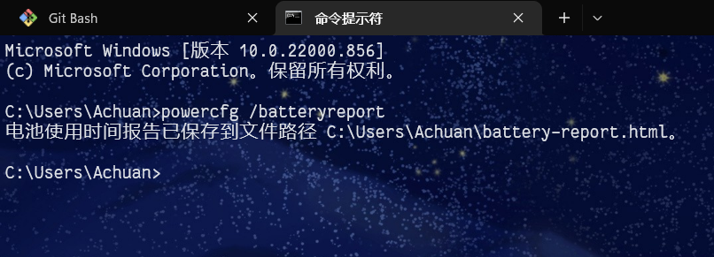
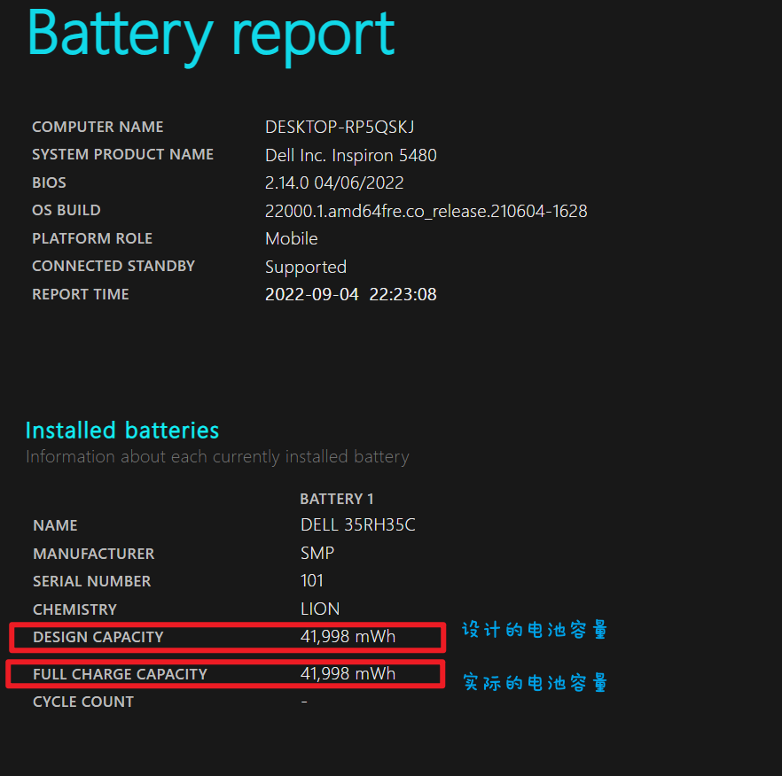
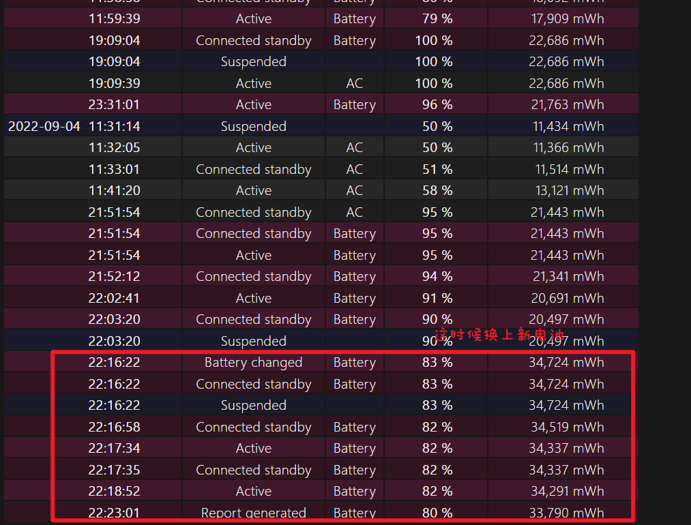
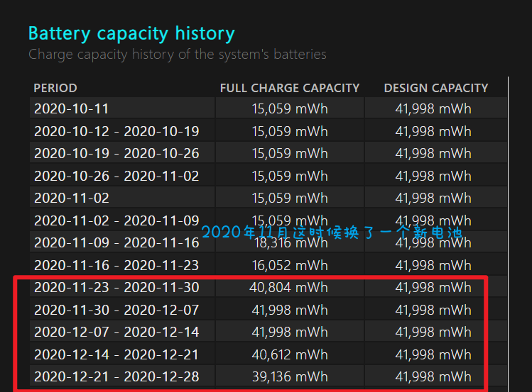
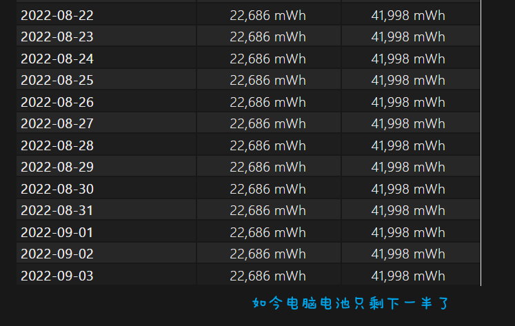

不需要其他软件，直接用cmd命令就可以。

在cmd窗口输入`powercfg /batteryreport`，生成电池使用情况报告html，

​

打开html，可以看到详细的电池报告。  

Installed batteries这里，最重要的两个信息是Design capacity(电池设计容量)和Full charge capacity(满电容量)，这两个信息是通过读取电池信息得到的。我们可以粗略通过这两个数据判断电池是否有衰减，如果发现“FULL CHARGE CAPACITY”大幅小于“DESIGN CAPACITY”，那么电池衰减可能就比较厉害了

下图中，Design capacity=Full charge capacity这是由于我已经换了新电池。

​

往下翻，还有几栏信息，可以帮助了解电池状态。

* Recent usage观察到电池近三天的电量变化情况，有表格还带有图表。在“STATE”（状态）中，有“Active”（活动）和“Connected standby”（连接待机）等情况，而“SOURCE”（电源）中，则可以观察到电源来自“Battery”（电池）还是“AC”（交流电）。之后一栏“CAPACITY REMAINING”则是电池电量的变化了，判断电脑掉电快到底是耗电异常还是容量衰减，这个数据很有参考价值。

  ​
* 在“Usage history”一栏中，可以看到电脑每天“ACTIVE”（活动）和“CONNECTED STANDBY”（连接待机）的时长。有时候电量消耗太快是因为电脑莫名其妙唤醒，没有待机，在这里可以查看耗电太多是不是这一原因。

  ​
* Battery capacity history可以看过去电池容量的变化，下图可以看到2020年11月我电脑电池实际容量只有15Wh了，后来在2020年11月底电池容量突然恢复正常了。

  ​

  为什么呢？这是因为我在这时候换了一个新电池，我重新找了淘宝的购物记录，发现确实就是这时候买的电池。

  ​

  然后再往下滑，可以看到现在的电池容量也只有大约22Wh了，不用充电器大概只能支持40min这样（大概才用了1年9个月）。

  ​

## 总结

* 在cmd命令行中使用`powercfg /batteryreport`可以很详细的查看当前电池实际容量来预估电池寿命，还可以追踪过去电池的实际容量变化。
* 虽然这个Windows自带的电池检测功能用起来是麻烦了点，但对比第三方软件，它更加靠谱，展示的信息也更多。
