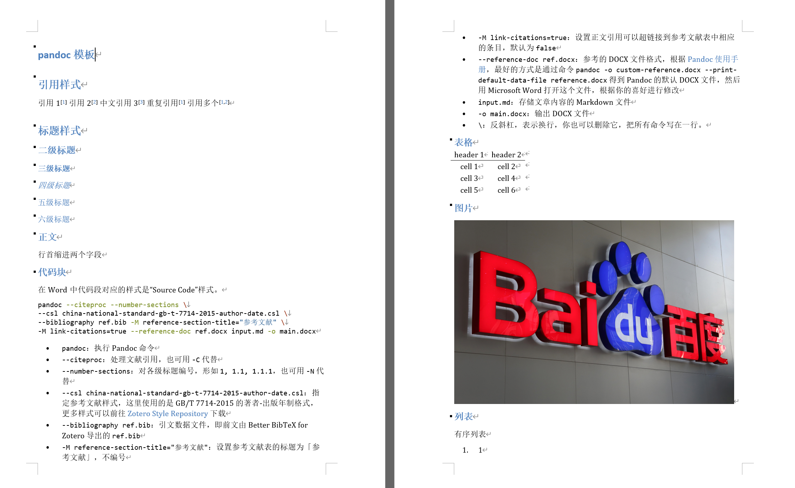
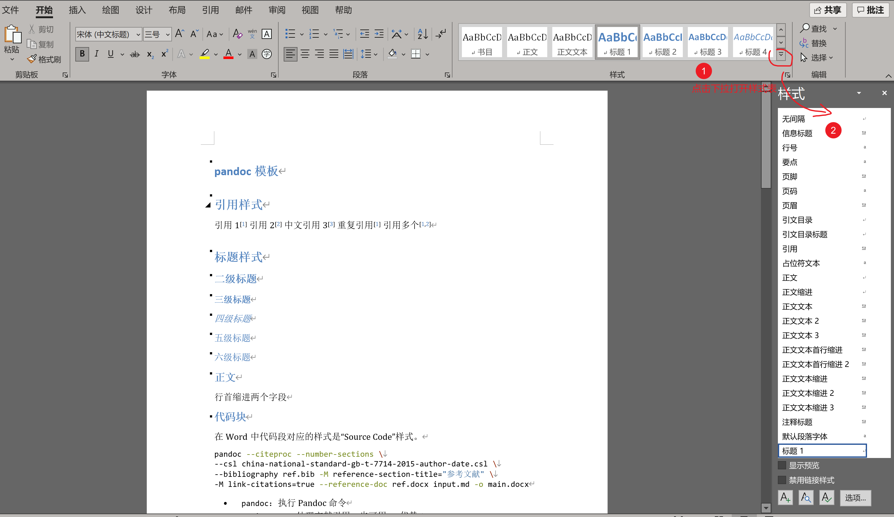
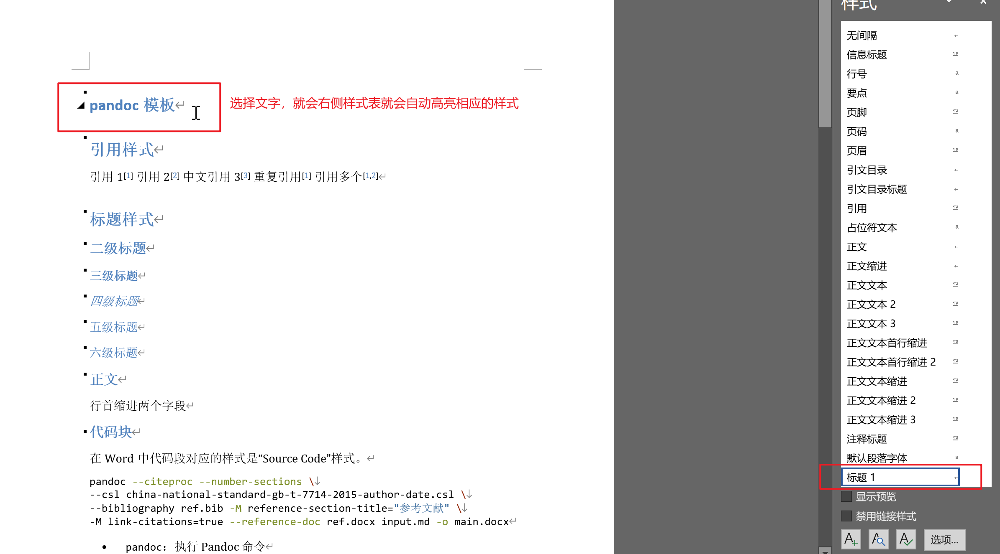
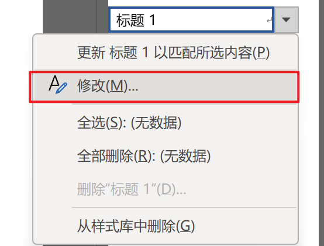
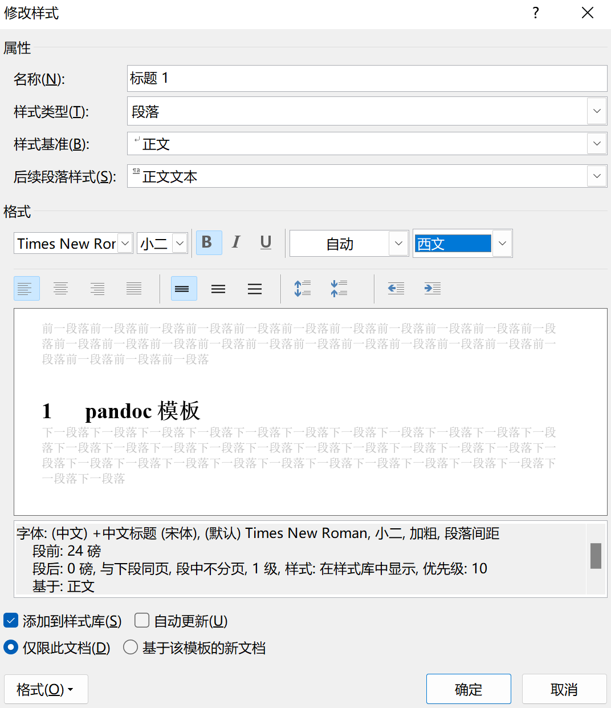
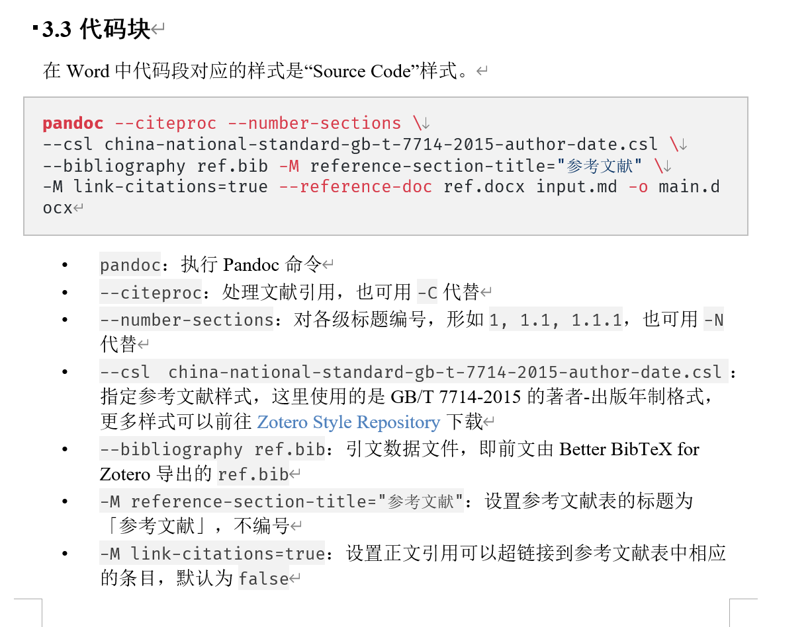
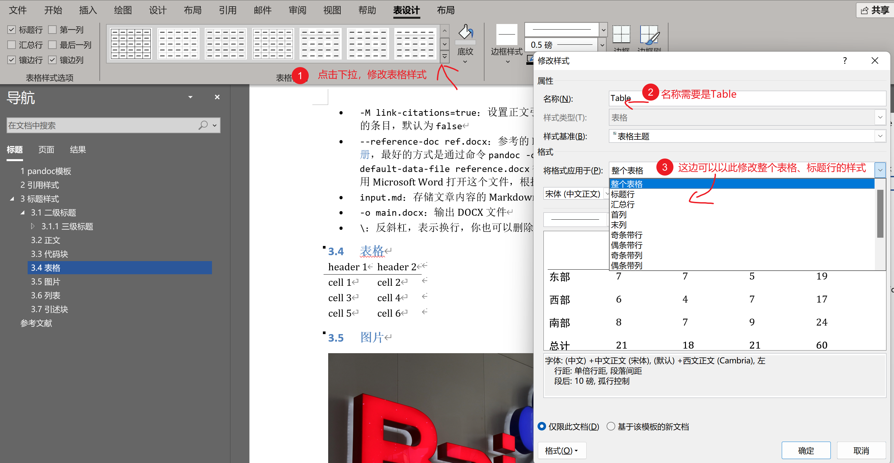
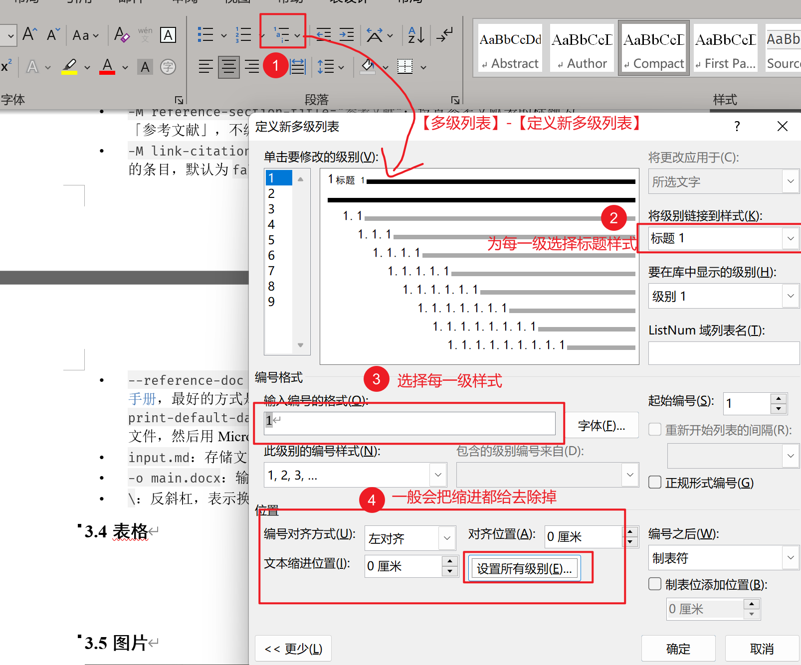
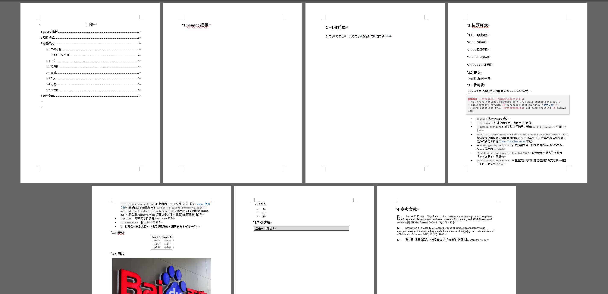

# 设置word模板，让 pandoc 转化md为规范美观的docx

首先先介绍下我为什么要用 pandoc 将 Markdown 转换为 Microsoft Word 的文件，以及写这篇文章。

1. 正式的报告常常需要交 Word 格式的，而且需要引用参考文献。但我还是喜欢先用 Markdown 写稿子，最后再用 Word 来完善文稿内容和排版，让内容和样式相分离。
2. 就算一些软件比如思源笔记、Typora 可以直接导出 docx 文件，但目前还不怎么不支持设置自定义的参数，导出的 docx 需要进行很大程度的修改，很费力，是重复劳动。

所以这篇文章的目的就是介绍下如何更丝滑的把 Markdown 初步导出成满意的 Word 样式的，最后会点下Quarto这个更好用的工具。

## Pandoc 基本命令

先简单介绍下 Pandoc。这个是一个很强大的通用文档转换工具，可以支持大量标记语言之间的格式转换，例如 Markdown 、Microsoft Word、PowerPoint、 Jupyter Notebook、HTML、PDF、LaTeX、Wiki、EPUB 格式之间的相互转换。这篇文章里，我主要介绍 Markdown 怎么转换为 Microsoft Word 的文件。

首先先介绍 pandoc 的基本命令。

```bash
pandoc --citeproc --number-sections \
--csl gb-t-7714-2015-numeric-bilingual-no-uppercase-no-url-doi.csl \
--bibliography ref.bib -M reference-section-title="参考文献" \
-M link-citations=true --reference-doc=ref.docx -s input.md -o main.docx
```

别看到这个就跑路了，来一点点拆解：

* ​`pandoc`​：执行 Pandoc 命 p 令
* ​`--citeproc`​：处理文献引用，也可用 `-C`​ 代替
* ​`--number-sections`​：对各级标题编号，形如 `1, 1.1, 1.1.1`​，也可用 `-N`​ 代替
* ​`--csl gb-t-7714-2015-numeric-bilingual-no-uppercase-no-url-doi.csl`​：指定参考文献样式，中文报告一般用 GB/T 7714-2015 的格式，更多样式可以前往 [Zotero Style Repository](https://www.zotero.org/styles) 下载，需要注意的是pandoc目前不支持CSL-M的csl文件，那种多个作者能中文显示等、英文显示et al的就不能使用，会导致参考文献列表重复，需要把这类csl里的layout进行注释。

  ```xml
  <bibliography entry-spacing="0" et-al-min="4" et-al-use-first="3" second-field-align="flush">
    <!-- 取消这部分注释可以使用 CSL-M 的功能支持双语 -->
    <!-- <layout suffix="." locale="en">
      <text variable="citation-number" prefix="[" suffix="]"/>
      <text macro="entry-layout"/>
    </layout> -->
    <layout suffix=".">
      <text variable="citation-number" prefix="[" suffix="]"/>
      <text macro="entry-layout"/>
    </layout>
  </bibliography>
  ```
* ​`--bibliography ref.bib`​：引文数据文件，类似下面这样。在 md 文档里可以用 `描述 [@key]`​ 的方式进行引用文献，比如 `谷歌学术nb[@董文鸳2011我国谷歌学术搜索研究综述]`​

  ```plaintext
  @article{董文鸳2011我国谷歌学术搜索研究综述,
      title   = {我国谷歌学术搜索研究综述},
      author  = {董文鸳},
      journal = {新世纪图书馆},
      number  = {9},
      pages   = {43--45},
      year    = {2011},
      langid = {chinese},
  }
  ```
* ​`-M reference-section-title="参考文献"`​：设置参考文献表的标题为「参考文献」
* ​`-M link-citations=true`​：设置正文引用可以超链接到参考文献表中相应的条目，默认为 `false`​
* ​`--reference-doc ref.docx`​：参考的 docx 文件格式模板
* ​`input.md`​：存储文章内容的 Markdown 文件
* ​`-o main.docx`​：输出 docx 文件
* ​`\`​：反斜杠，表示换行，你也可以删除它，把所有命令写在一行。

‍

## 如何生成和修改模板

### 生成简陋的模板文件

根据创建的基本样式 md `basic.md`​ 生成一个 docx 文件

```bash
pandoc --citeproc \
--csl gb-t-7714-2015-numeric-bilingual-no-uppercase-no-url-doi.csl \
--bibliography ref.bib -M reference-section-title="参考文献" \
-M link-citations=true -s basic.md -o templates.docx

```

可以预览下生成这个 docx 文件，这个默认生成的样式特别难看，标题喜欢用蓝色，和中文报告的格式非常不一致。

​

‍

接着我们会将这个 docx 文件的样式进行修改，以后就可以当成模板，省心省力的把 md 导出成符合格式要求的 word 文件了。

### 如何修改模板文件

需要注意的是这里修改模板样式，不是直接修改内容里的样式，必须要修改 word 的样式

​

以标题举例

点击一个标题之后，右侧样式表就会自动选择【标题 1】

​

接着我们右击，选择修改

​

把标题 1 的样式修改为

* 字号：小二
* 字体：中文黑体，英文 Times New Roman
* 居中
* 段前分页

​

这个例子就算举好了，其他标题、正文等样式都以此类推

但有几个样式我再额外提一下

代码块样式 Source Code，我是加了在【边框和底纹】添加了灰色的边框和底纹

​

表格样式 Table，我设置的是三线表，具体怎么做可以参考知乎[这篇教学](https://zhuanlan.zhihu.com/p/33000931)，把表格上下的边框设置为 1.5 磅，表头下面的边框设置为 0.75 磅。需要注意的是表格的修改必须全选中表格后，在【表设计-修改表格样式】这里修改，修改的样式名称需要是【Table】

​

另外我给这份模板还自动加了编号，这是因为我觉得 pandoc 虽然本身有--number-sections 参数，但是这个只是人为加上的，编号不会随着标题变化而变化，其实没有大用。在 word 里给标题编号除了让结构更清晰以外，还有一个重要的作用是让表格和图片的题注自动编号！

如何设置多级标题我这里只点一下，网上教程很多  
​​

### 修改之后的模板

大概是这样，可能导出 word 之后还不能直接上交，还需要稍微修改，但是模板能够把主要样式以及字体设置完毕之后，已经省下了很多很多力气了，可以更愉快的用 md 来写稿，word 上交了。

​

## 总结

总结下 pandoc 将 md 导出 docx 格式的优点

* 导出速度很快，几乎在几秒内。相较于很重的 $\LaTeX$ 渲染，简直轻快极了！
* 可以设置模板的样式进行复用。
* 支持参考文献引用（并且支持超链接点击跳转，zotero 我都找不到方式实现……）
* 后续可以直接在Word里修改内容，不像$\LaTeX$导出pdf，修改内容就得重新渲染

当然也有一些缺点啦，一些样式的处理比如代码块实现不了太精致的样式，参考文献 csl 格式不支持多语言识别，导出之后可能还需要后期调整样式，例如表格和图片大小，等等。

总的来说，这种方式对于喜欢用 md 写稿，又需要交 word 文件的人，还是帮助很大很大的。像少数派[这篇文章](https://sspai.com/post/64842)，就介绍了自己为什么不用 word 写稿、为什么不用 $\LaTeX$ 写稿的原因，感兴趣可以看看。

最后，本文介绍的这种通过命令行调用 pandoc 导出 md 为 docx 的方式还是非常繁琐的，而且写稿与导出其实是分离开的。

下一篇文章我将会主要介绍 [Quarto](https://quarto.org/) 这个工具。Quarto 是下一代的 Rmarkdown，相比 Rmarkdown 来说，把生态给大一统了，你甚至不需要有 R 环境也能用，VSCode 上也有专门的[插件](https://marketplace.visualstudio.com/items?itemName=quarto.quarto)。Quarto 的强大之处在于，不仅仅在于可以渲染代码运行结果，而且导出文档方面是我目前见过最无敌的存在，相信我，用上它，你会见到 markdown 的另一片天空。你只需要把 md 改成 qmd 后缀，加上一个 yaml 头，轻轻一点渲染按钮，就可以导出 word、html、ipynb、GFM 规范的 md（还可以设置公式导出为纯文本还是图片），甚至当成简易版的 $\LaTeX$，$\LaTeX$ 代码与 markdown 语法混用，导出样式精美的 pdf。好啦，这里就不多说了，等我下篇博客吧。

---

本文涉及的文件已上传至[GitHub](https://github.com/Achuan-2/mini/tree/main/pandoc)
