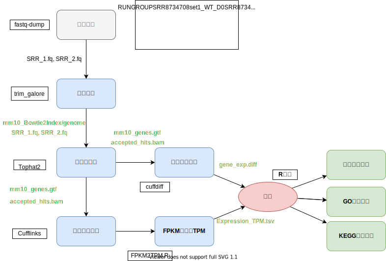​

## 一、数据来源

### 数据简介

本次分析的数据来源于在 2020 年五月发表在 Nucleic Acids Res 的《Nono deficiency compromises TET1 chromatin association and impedes neuronal differentiation of mouse embryonic stem cells》（doi: [10.1093/nar/gkaa213](https://doi.org/10.1093/nar/gkaa213)）。该文由复旦大学生物医学研究所表观遗传学实验室，哈佛大学医学院附属布莱根妇女医院内分泌系、哈佛大学医学院附属波士顿儿童医院新生医学与表观遗传学研究室共同发表，第一作者为 Wenjing Li 和 Violetta Karwacki-Neisius，石雨江教授和吴飞珍副研究员为共同通讯作者。该文涉及的代码见 [FeizhenWu/Nono](https://github.com/FeizhenWu/Nono)。

NONO 是一种 DNA/RNA 结合蛋白，该文揭示了 **NONO在小鼠胚胎干细胞(mESCs)的神经元分化过程中起着关键作用，Nono缺失会影响到TET1与染色质结合并阻碍小鼠胚胎干细胞的神经分化**：Nono 基因缺失将使得神经元分化的关键特定基因上调失败，从而阻碍了神经元谱系的定型；许多 NONO 调控的基因也是 DNA 去甲基化酶 TET1 的靶向基因；将野生型 NONO 蛋白重新引入 NONO KO 细胞，不仅使得大部分 NONO/TET1 共调控基因的恢复正常表达，还可以挽救 NONO 缺陷的 mESCs 的神经分化缺陷；作者还发现 NONO 能通过其 DNA 结合域直接与 TET1 相互作用，并将 TET1 招募到基因位点以调节 5-羟甲基胞嘧啶水平。NONO 的缺失会导致 TET1 与染色质显著分离，使得神经元基因的 DNA 羟甲基化失调。

该文涉及的 RNA-seq 测序数据在 NCBI SRA 数据库编号为 [PRJNA527295](https://www.ncbi.nlm.nih.gov/bioproject/PRJNA527295)。测序的细胞为小鼠胚胎干细胞（E14TG2a），分别对三类 mESCs 细胞进行测序（WT，Nono KO，Nono KO+WT），使用 Illumina HiSeq 2500 测序仪进行转录组 RNA 测序。

本次实验选取了四个 Run（测序数据），分别为 SRR8734708（set1_WT_D0）、SRR8734712（set1_NonoKO_D0）、SRR8734718（Set2_WT_D0）和 SRR8734722（Set2_NonoKO_D0）。

|RUN|GROUP|
| ----------| --------------|
|SRR8734708|set1_WT_D0|
|SRR8734712|set1_NonoKO_D0|
|SRR8734718|Set2_WT_D0|
|SRR8734722|Set2_NonoKO_D0|

### 数据下载

在服务器上创建项目文件夹 `mkdir ~/workplace/homework1`​

通过在 NCBI 的 SRA 数据库输入 SRR id，打开 [Run Selector](https://www.ncbi.nlm.nih.gov/Traces/study/?acc=SRP188551&o=acc_s%3Aa&s=SRR8734722,SRR8734718,SRR8734708,SRR8734712)，选择 4 个 Run 后勾选 Selected，下载 Metadata 和 Accession List，上传到服务器项目文件夹中。

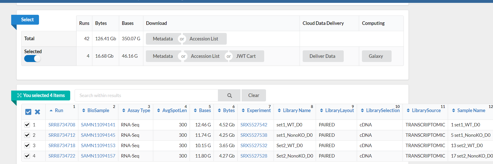

​`SRR_Acc_List.txt` ​文件内容

```plaintext
SRR8734722
SRR8734718
SRR8734708
SRR8734712
```

服务器项目文件夹创建 `group.csv`​，记录 SRR ID 和分组信息

```plaintext
SRR8734708,set1_WT_D0
SRR8734712,set1_NonoKO_D0
SRR8734718,set2_WT_D0
SRR8734722,set2_NonoKO_D0
```

然后在服务器上使用 sratoolkit 软件的 fastq-dump 命令进行下载测序数据。fastq-dump 可以下载 fastq 格式的文件，也可以将下载好的 sra 格式文件转换为 fastq 格式。

1. 配置 sratoolkit（v2.11.0）

   ```bash
   vdb-config --interactive
   # 然后按s，o，e，完成配置
   ```
2. 编写 slurm 作业脚本：`vim ~/scripts/fastq-dump.sh`

   ```bash
   #!/bin/bash
   #SBATCH -J fastq-dump
   #SBATCH -p dna
   #SBATCH -N 1
   #SBATCH --mem=10G
   #SBATCH --cpus-per-task=2
   #SBATCH -o slurm.%j.%x.out        # STDOUT
   #SBATCH -e slurm.%j.%x.err        # STDERR
   #SBATCH --mail-type=END
   #SBATCH --mail-user=jxsu22@m.fudan.edu.cn

   fastq-dump --split-3 --gzip $1 --outdir $2
   ```
3. 运行 shell 脚本

   ```bash
   PROJECT=/home/u22211520038/workplace/homework1
   cd $PROJECT
   cat $PROJECT/SRR_Acc_List.txt| while read id;do
       sbatch ~/scripts/fastq-dump.sh ${id} $PROJECT/01_rawdata/ 
   done
   ```
4. 下载完成

   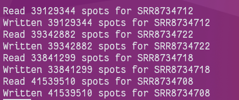​

   ​

   ​

## 二、分析过程

### 1、trim_galore 去除低质量的 reads 和 adaptor

[Trim Galore](https://github.com/FelixKrueger/TrimGalore) 使用 Perl 语言对 [FastQC](https://www.bioinformatics.babraham.ac.uk/projects/fastqc/) 和 [Cutadapt](https://github.com/marcelm/cutadapt) 进行了封装。可以用于过滤低质量碱基和去除序列 3' 末端的 adapter。可适用于所有高通量测序，包括 RRBS(Reduced Representation Bisulfite-Seq ),、Illumina、Nextera 和 smallRNA 测序平台的双端和单端数据。

```shell
$ trim_galore --version

                        Quality-/Adapter-/RRBS-/Speciality-Trimming
                                [powered by Cutadapt]
                                  version 0.6.7

                               Last update: 11 05 2020
```

参数

* `--fastqc`：Run FastQC in the default mode on the FastQ file once trimming is complete.
* `--illumina`：Adapter sequence to be trimmed is the first 13bp of the Illumina universal adapter AGATCGGAAGAGC instead of the default auto-detection of adapter sequence.
* `-o/--output_dir <DIR>`：If specified all output will be written to this directory instead of the current directory. If the directory doesn't exist it will be created for you.
* `--gzip`：Compress the output file with `gzip`. If the input files are gzip-compressed the output files will be automatically gzip compressed as well.

实操过程

1. 编写 trim_galore 的 slurm 作业脚本：`vim ~/scripts/trim_galore.sh`​

   ```bash
   #!/bin/bash
   #SBATCH -J trim_galore
   #SBATCH -p dna
   #SBATCH -N 1
   #SBATCH --mem=20G
   #SBATCH --cpus-per-task=4
   #SBATCH -o slurm.%j.%x.out        # STDOUT
   #SBATCH -e slurm.%j.%x.err        # STDERR
   #SBATCH --mail-type=END  # 发送哪一种email通知：BEGIN,END,FAIL,ALL
   #SBATCH --mail-user=jxsu22@m.fudan.edu.cn

   mode=$1
   SRR=$2
   if [ "$mode" == "single" ];then
       # 如果是单端
       trim_galore --illumina --fastqc  $SRR.fastq.gz
   elif [ "$mode" == "paired" ];then
       # 如果是多端
       trim_galore --illumina --fastqc --paired ${SRR}_1.fastq.gz ${SRR}_2.fastq.gz
   fi
   ```
2. 运行 shell 脚本，将 trim_galore 作业脚本提交到 slurm 系统

   ```bash
   PROJECT=/home/u22211520038/workplace/homework1
   mode=paired

   cd $PROJECT/01_rawdata/
   cat $PROJECT/SRR_Acc_List.txt| while read SRR;do 
       sbatch ~/scripts/trim_galore.sh $mode $SRR
   done
   ```
3. 运行结束：在项目 `$PROJECT/01_rawdata/` ​文件夹下，新生成了双端测序的过滤文件，以 SRR8734708 测序文件为例：

   ​`SRR8734708_1.fastq.gz-> SRR8734708_1_val_1.fq.gz`​

   ​`SRR8734708_2.fastq.gz->SRR8734708_2_val_2.fq.gz`​

   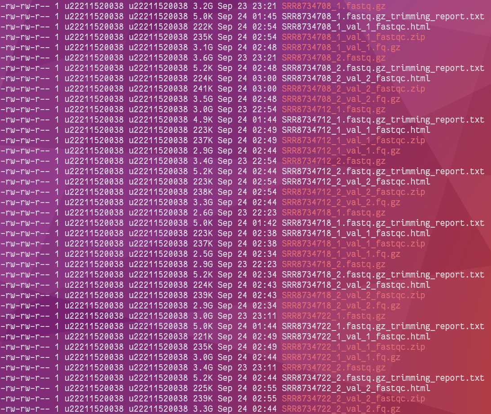​

> 如果是单端测序模式，trim_galore 则会默认生成带 trimed.fq.gz 的数据文件

### 2、使用 Tophat2 比对和 Cufflinks 计算基因表达

[Tophat2](https://ccb.jhu.edu/software/tophat/index.shtml) 是一个比对工具，本身实际不能比对，而是通过调用 bowtie/bowtie2 进行比对。Tophat 最初只能调用 bowtie，2012 年 4 月 9 日 Tophat 发布了 2.0.0 版本，宣布支持 bowtie2 的比对，将其称之为 Tophat2。进行比对时，需要输入<u>基因组的索引</u>，而不是直接输入基因组序列，这是为了比对更加快速、减小计算内存，帮助比对软件更快速的找到目标区域。

[Cufflinks](http://cole-trapnell-lab.github.io/cufflinks/) 是一个主要用于基因表达量的计算和差异表达基因分析的软件包。其下主要包含 cufflinks，cuffmerge，cuffcompare 和 cuffdiff 等几支主要的程序。

* cufflinks 可以通过 tophat2 生成的 accepted_hits.bam 文件计算基因的 FPKM 值、输出基因组注释 gtf 文件。
* cuffdiff 则可以通过 tophat2 生成的 accepted_hits.bam 文件和基因组注释 gtf 文件计算差异表达基因。

实操过程

1. 先准备参考基因组

   1. 参考基因组地址

      * 基因索引文件文件：`/home/public/share/Genomes/mm10_Bowtie2Index`​
      * 基因注释文件地址：`/home/public/share/Genomes/mm10_genes.gtf`​
   2. 将参考基因组软连接到项目文件夹下

      ```bash
      PROJECT=/home/u22211520038/workplace/homework1
      cd $PROJECT
      mkdir $PROJECT/00_index
      # 参考基因组
      ln -s /home/public/share/Genomes/mm10_Bowtie2Index $PROJECT/00_index
      # 基因注释
      ln -s /home/public/share/Genomes/mm10_genes.gtf $PROJECT/00_index

      ```
2. 编写运行 tophat2 和 cufflinks 的脚本：`vim tophat2_cufflinks.sh`

   ```bash
   #!/bin/bash
   #SBATCH -J tophat2_cufflinks
   #SBATCH -p dna
   #SBATCH -N 4
   #SBATCH --mem=20G
   #SBATCH --cpus-per-task=4
   #SBATCH -o slurm.%j.%x.out        # STDOUT
   #SBATCH -e slurm.%j.%x.err        # STDERR
   #SBATCH --mail-type=END  # 发送哪一种email通知：BEGIN,END,FAIL,ALL
   #SBATCH --mail-user=jxsu22@m.fudan.edu.cn

   echo "Usage:"
   echo "   tophat2_cufflinks.sh {mode} {threads} {transcriptome-index} {bowtie2-index} {SRR} {fq1} [{fq2}] "
   echo ""


   INDEX=$PWD/00_index
   DATA=$PWD/01_rawdata
   RESULT=$PWD/02_result

   mode=$1
   if test -z $mode # 检测字符是否为空
   then
      echo "please input the mode(single or paired)"
      exit
   fi
   threads=$2
   if test -z $threads
   then
      echo "please input the number of threads"
      exit
   fi

   Annotation=$3
   if test -z $Annotation
   then
      echo "please input transcriptome-index(/share/Genomes/Homo_sapiens/UCSC/hg19/Annotation/Genes/hg19_genes/genes.gff)" 
      exit
   fi

   bowtie2Index=$4
   if test -z $bowtie2Index
   then
      echo "please input bowtie2-index(/share/Genomes/Homo_sapiens/UCSC/hg19/Sequence/Bowtie2Index/genome)" 
      exit
   fi

   SRR=$5
   if test -z $SRR
   then
      echo "please input SRR id"
      exit
   fi

   fq1=$6
   if test -z $fq1
   then
      echo "please input fasta1"
      exit
   fi


   if [ "$mode" == "paired" ];then

      fq2=$7
      if test -z $fq2
      then
         echo "please input fasta1"
         exit
      fi
   fi

   #====================================================
   echo "Running info"
   echo "Project:    "$PWD
   echo "Read:       "$SRR
   echo "Annotation: "$Annotation
   echo "Genome:     "$bowtie2Index
   echo " "

   ########################RUN##############################
   mkdir -p ${RESULT}/tophat2/${SRR}
   mkdir -p ${RESULT}/cufflinks/${SRR}

   if [ "$mode" == "single" ];then
       # 如果是单端
       tophat2 -p ${threads} -o ${RESULT}/tophat2/${SRR} ${INDEX}/${bowtie2Index} ${DATA}/${fq1}
   elif [ "$mode" == "paired" ];then
       # 如果是多端
       tophat2 -p ${threads} -o ${RESULT}/tophat2/${SRR} ${INDEX}/${bowtie2Index} ${DATA}/${fq1} ${DATA}/${fq2}
   fi

   cufflinks -p ${threads} -o ${RESULT}/cufflinks/${SRR} -G ${INDEX}/$Annotation ${RESULT}/tophat2/${SRR}/accepted_hits.bam

   echo " "
   echo " Running ${SRR} is compeleted."
   echo " "
   ```
3. 运行 shell 脚本，将该作业脚本提交到 slurm 系统

   ```bash
   PROJECT=/home/u22211520038/workplace/homework1
   mode=paired
   cd $PROJECT
   cat $PROJECT/SRR_Acc_List.txt | while read SRR;do
       sbatch ~/scripts/Tophat_Cufflinks.sh \
           $mode \
           4 \
           mm10_genes.gtf \
           mm10_Bowtie2Index/genome \
           ${SRR} \
           ${SRR}_1_val_1.fq.gz \
           ${SRR}_2_val_2.fq.gz 
   done
   ```
4. 运行结束：在项目 $PROJECT/02_result/文件夹下，tophat2 和 cufflinks 文件夹分别存放两个软件运行的结果。

   1. tophat2 的运行结果

      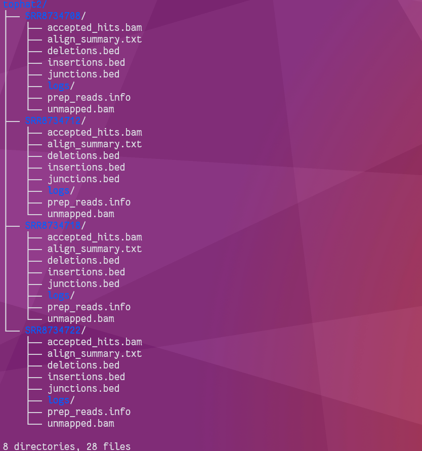​

      其中最有用的是 accepted_hits.bam，记录了 reads 比对到参考基因组的数据
   2. cufflinks 的运行结果：

      ​

      其中常用的是 `genes.fpkm_tracking` 和 `transcripts.gtf` 文件

      * `genes.fpkm_tracking`：isoforms (可以理解为 gene 的各个外显子)的 fpkm 计算结果；
      * `transcripts.gtf`：转录组的 gtf，该文件包含 Cufflinks 的组装结果 isoforms；

### 3、FPKM 转化为 TPM

在 RNA-Seq 的分析中，需要对基因或转录本的 read counts 数目进行标准化（normalization）。因为落在一个基因区域内的 read counts 数目取决于基因长度和测序深度，一个基因越长，测序深度越高，落在其内部的 read counts 数目就会相对越多。在进行基因差异表达的分析时，往往是在多个样本中比较不同基因的表达量，如果不进行数据标准化，比较结果是没有意义的。read counts 数目标准化的两个关键因素就是基因长度和测序深度，常常用 RPKM (Reads Per Kilobase Million), FPKM (Fragments Per Kilobase Million) 和 TPM (Transcripts Per Million)作为标准化数值。

RPKM 和 FPKM 的定义是相同的，唯一的区別是 FPKM 用于双端测序文库，而 RPKM 用于单端测序文库。

FPKM 和 TPM 都能够矫正掉<u>基因长度</u>及<u>测序深度</u>对 gene 表达定量的影响，区别在于

* FPKM 先计算比对到每个基因的 read 数占 reads 总数的比例，再考虑基因的长度；
* 而 TPM 是先考虑基因的长度，再把 read counts 转化为占处理之后的总数的比例。

之所以要将 FPKM 转化为 TPM，是因为 TPM 可以使得每个样本的表达量**总和都是1 Million**，使得 TPM 中的基因表达量可以直接进行样本间的比较。

编写 FPKM2TPM.R 脚本，改进自 `/home/public/software/wfz_scripts/FPKM2TPM.R`​，主要改进点是把输出文件的 xls 格式改成了 tsv 文件格式。

```R
#!/home/u22211520038/.conda/envs/achuan/bin/Rscript
# ====================================================================
suppressPackageStartupMessages(library("optparse"))
# ====================================================================
option_list <- list(
  make_option(c("-f", "--files"),
    type = "character", default = "genes.fpkm_tracking",
    help = "To specify fpkm files generated by cufflinks with comma-separate [default %default]"
  ),
  make_option(c("-l", "--labels"),
    type = "character", default = "",
    help = "To specify labels [default %default]"
  ),
  make_option(c("-o", "--output"),
    type = "character", default = "Expression",
    help = "To specify output file [default %default]"
  )
)

parser <- OptionParser(
  usage = "%prog [options]", option_list = option_list,
  description = "\nThe script is to convert FPKMs into TPMs.",
  epilogue = "Feizhen Wu(wufz@fudan.edu.cn), July 09, 2018.\n"
)
arguments <- parse_args(parser, positional_arguments = 0, print_help_and_exit = T)
opt <- arguments$options
files <- strsplit(opt$files, ",")[[1]]
labels <- strsplit(opt$labels, ",")[[1]]
output <- opt$output


library(data.table)
library(pheatmap)
FPKM2TPM <- function(myfile, myName = myfile) {
  if (myName == myfile) {
    myName <- sub(pattern = "(.*)\\..*$", replacement = "\\1", basename(myfile))
  }
  cat("The label of", myfile, " was assigned as ", myName, "!\n")
  if (file.access(myfile) == -1) {
    stop(sprintf("Specified file ( %s ) does not exist", myfile))
  }
  Exp <- fread(myfile, header = T)[, c("gene_id", "FPKM")]
  Exp <- Exp[!grep("^Mir", Exp$gene_id), ]
  Exp <- Exp[!grep("^MIR", Exp$gene_id), ]
  Exp <- Exp[!duplicated(Exp$gene_id), ]
  ss <- sum(Exp$FPKM)
  Exp$Tpm <- Exp$FPKM / ss * 10^6
  Tpm <- Exp[, c(1, 3)]
  Fpkm <- Exp[, c(1, 2)]
  names(Tpm) <- c("gene_id", myName)
  names(Fpkm) <- c("gene_id", myName)
  Result <- list()
  Result$Tpm <- Tpm
  Result$Fpkm <- Fpkm
  return(Result)
}

# ===================================
if (length(labels) > 0) {
  Exp1 <- FPKM2TPM(files[1], labels[1])
} else {
  Exp1 <- FPKM2TPM(files[1])
}
Exp_Tpm <- Exp1$Tpm
Exp_Fpkm <- Exp1$Fpkm
i <- 2
while (i <= length(files)) {
  if (i <= length(labels)) {
    Exp1 <- FPKM2TPM(files[i], labels[i])
  } else {
    Exp1 <- FPKM2TPM(files[i])
  }
  Exp_Fpkm <- merge(Exp_Fpkm, Exp1$Fpkm, by = "gene_id")
  Exp_Tpm <- merge(Exp_Tpm, Exp1$Tpm, by = "gene_id")
  i <- i + 1
}

fwrite(Exp_Tpm, file = paste(output, "_TPM.tsv", sep = ""), quote = F, sep = "\t", row.names = F)
fwrite(Exp_Fpkm, file = paste(output, "_FPKM", ".tsv", sep = ""), quote = F, sep = "\t", row.names = F)

Exp <- Exp_Tpm[, -1]
p <- cor(Exp)
pdf(file = paste(output, "_TPM_correlation.pdf", sep = ""), height = 360 / 100, width = 437 / 100, onefile = F)
pheatmap(p)
dev.off()
write.table(p, file = paste(output, "_TPM_correlation.tsv", sep = ""), quote = F)
```

接下来编写 shell 脚本以批量传入参数运行，将 cufflinks 计算得到的各样本 FPKM 转化为 TPM。

```bash
PROJECT=/home/u22211520038/workplace/homework1
mkdir -p $PROJECT/02_result/fpkm
mkdir -p $PROJECT/02_result/FPKM2TPM
cd $PROJECT/02_result

# 创建软链接，并以分组命名
cat $PROJECT/group.csv | while IFS="," read -r SRR group;do
    ln -s $PROJECT/02_result/cufflinks/${SRR}/genes.fpkm_tracking $PROJECT/02_result/fpkm/${group}.fpkm
done

# 获得fkpm的列表
cd $PROJECT/02_result/fpkm
delim=""
fpkm_list=""
for item in `ls *.fpkm`; do
  temp="${delim}${item##*/}"
  fpkm_list="${fpkm_list}${temp}"
  delim=","
done

# 通过Rscript进行FPKM转化TPM的转化
~/scripts/FPKM2TPM.R  -f $fpkm_list -o $PROJECT/02_result/FPKM2TPM/Expression
```

FPKM2TPM.R 还会调用 pheatmap 包根据各样本的 TPM 表达量来绘制热图

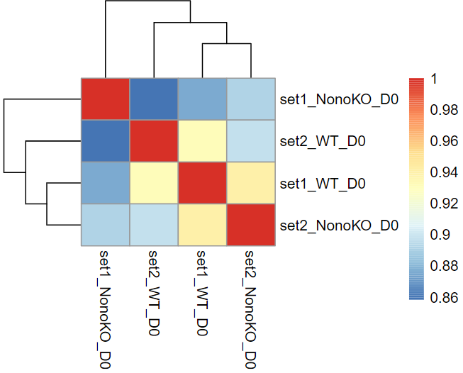​

‍

### 4、用 cuffdiff 计算基因差异表达

```shell
$ cuffdiff -h
Usage:   cuffdiff [options] <transcripts.gtf> <sample1_hits.sam> <sample2_hits.sam> [... sampleN_hits.sam]
   Supply replicate SAMs as comma separated lists for each condition: sample1_rep1.sam,sample1_rep2.sam,...sample1_repM.sam
```

了解 cuffdiff 的输入参数，需要输入 transcripts.gtf 和 sample_hits.bam 文件(或 sam 格式的文件）。

使用 cuffdiff 时需要注意

* 样本重复和多样本分别以逗号和空格分隔：当一个样本有多个 replicate 时，使用逗号隔开。对于多个 sample，用空格隔开，以计算 samples 间的基因表达的差异性。
* log2(fold_change)的值是 log2(sample2/sample1)，在统计上下调关系时需要注意输入的 sample 顺序，一般是 WT sample 在前，实验组 sample 在后。

这一步将使用 cuffdiff 根据 Tophat2 生成的各样本比对文件 accepted_hits.bam 以及小鼠的基因组注释文件寻找差异基因。

1. 先编写 cuffdiff 的作业脚本：`vim ~/scripts/cuffdiff.sh`

   ```bash
   #!/bin/bash
   #SBATCH -J cuffdiff
   #SBATCH -p dna
   #SBATCH -N 1
   #SBATCH --mem=8G
   #SBATCH --cpus-per-task=2
   #SBATCH -o slurm.%j.%x.out   # STDOUT
   #SBATCH -e slurm.%j.%x.err   # STDERR
   #SBATCH --mail-type=END  # 发送哪一种email通知：BEGIN,END,FAIL,ALL
   #SBATCH --mail-user=jxsu22@m.fudan.edu.cn

   outdir=$1
   gtf=$2
   bam_dir=$3
   label1=$4
   label2=$5

   sample1=$(ls $bam_dir/*$label1* | xargs | tr ' ' ',')
   sample2=$(ls $bam_dir/*$label2* | xargs | tr ' ' ',')
   cuffdiff -p 2 -o $outdir \
       -L $label1,$label2 \
       $gtf \
       $sample1 \ # Separate different samples with space
       $sample2
   ```
2. 然后运行 shell 脚本，提交该任务

   ```bash
   PROJECT=/home/u22211520038/workplace/homework1
   mkdir -p $PROJECT/02_result/bam
   mkdir -p $PROJECT/02_result/cuffdiff


   # 创建软链接，并以分组命名
   cat $PROJECT/group.csv | while IFS="," read -r SRR group;do
       ln -s $PROJECT/02_result/tophat2/${SRR}/accepted_hits.bam $PROJECT/02_result/bam/${group}.bam
   done


   cd $PROJECT/02_result/cuffdiff

   # 运行cuffdiff，进行差异基因分析
   sbatch ~/scripts/cuffdiff.sh \
       $PROJECT/02_result/cuffdiff \
       $PROJECT/00_index/mm10_genes.gtf \
       $PROJECT/02_result/bam \
       WT \
       NonoKO


   ```
3. 查看运行结果

   `ll ${Project}/02_result/cuffdiff`

   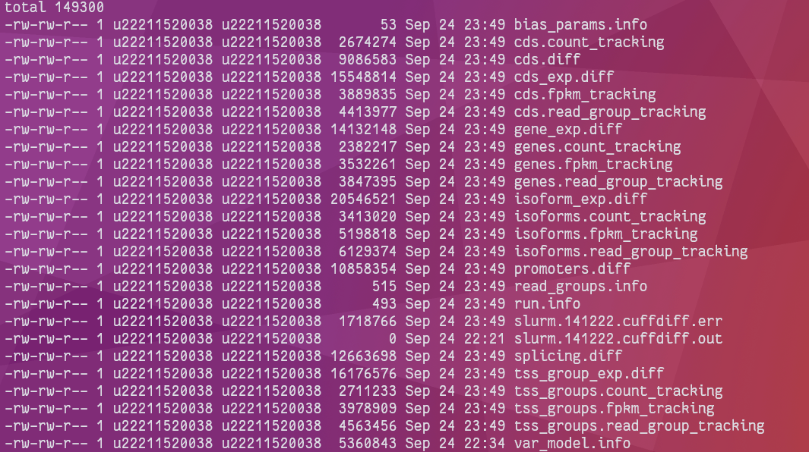​

   可以看到生成了很多文件，后面的差异基因分析将主要用到 gene_exp.dff。其中第三列是基因名，第五列和第六列是比较的两个样本名，第 10 列是 log2(foldchange)值，第 12 列是 pvalue。

   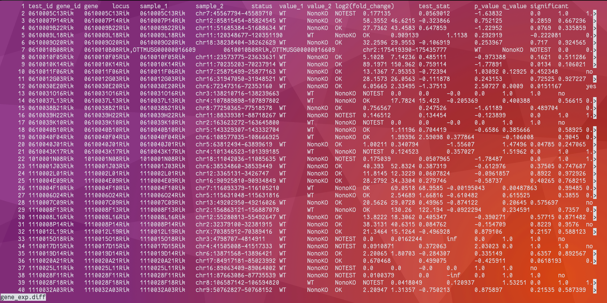​

## 三、R 语言代码

准备需要的 R 包

```R
if (!require("BiocManager")) install.packages("BiocManager")
if (!require("pheatmap")) BiocManager::install("pheatmap")
if (!require("clusterProfiler")) BiocManager::install("clusterProfiler")
if (!require("org.Mm.eg.db")) BiocManager::install("org.Mm.eg.db")
if (!require("cowplot")) BiocManager::install("cowplot")
```

设置工作目录

```r
setwd('~/workplace/homework1/02_result')
```

从 cuffdiff 生成的 gene_exp.diff，进行解析，提取 | log2(foadchange) |>1.5，p_value<0.05 的差异基因，保存为 `DiffGenes_FC1.5.txt`​

```R
DEG <- read.table("./cuffdiff/gene_exp.diff", header = T)
DEG <- DEG[, c(3, 10, 12)]
DEG <- DEG[is.finite(DEG$log2.fold_change.), ]
DEG <- DEG[abs(DEG$log2.fold_change.) > log2(1.5) & DEG$p_value < 0.05, ] # 提取log2(foadchange)>1.5，p_value<0.05的差异基因
names(DEG) <- c("genes", "foldchange", "pvalue")
DEG$regulation <- "up"
DEG$regulation[DEG$foldchange < 0] <- "down"
DEG <- DEG[order(abs(DEG$foldchange), decreasing = T), ] # 按照foldchange绝对值大小进行倒序排序
write.table(DEG, file = "plot/DiffGenes_FC1.5.txt ", sep = "\t", quote = F, row.names = F)
```

绘制差异基因的图

```R
# bar-plot
{
  library(ggplot2)
  tab <- as.data.frame(table(DEG$regulation))
  tab$Var1 <- factor(tab$Var1, levels = c("up", "down"))

  p <- ggplot(tab, aes(x = Var1, y = Freq, label = Freq, fill = Var1)) +
    geom_bar(stat = "identity")
  p <- p + geom_text(position = position_dodge(0.9), vjust = 0, size = 3) + ylim(0, max(tab$Freq) * 1.1)
  p <- p + theme_classic(8) + xlab("differential expression") + ylab("Number of genes")
  p <- p + ggtitle("diffgenes") + theme(legend.position = "none")
  p <- p + theme(plot.title = element_text(hjust = 0.5))
  p
  ggsave(p, filename = "plot/diffgene_number_barplot.pdf", width = 2.2, height = 2.2)
}

# heatmap
{
  library(scales)
  library(pheatmap)
  dd <- read.table("FPKM2TPM/Expression_TPM.tsv", header = T)
  # 取Top50的差异基因在各个样本的TPM
  DEG1 <- DEG[order(abs(DEG$foldchange), decreasing = T), ]
  num <- 50
  DEG1 <- DEG1[1:num, ]
  dd1 <- dd[dd$gene_id %in% DEG1$genes, ]
  row.names(dd1) <- dd1$gene_id
  dd1$gene_id <- NULL
  names(dd1) <- c("set1_NonoKO_D0", "set1_WT_D0", "set2_NonoKO_D0", "set2_WT_D0")
  dd2 <- t(apply(dd1, 1, rescale))
  # 绘制热图
  pdf(file = "plot/top_50gene.pdf", width = 3, height = 7)
  pheatmap(dd2, cutree_rows = 2, cutree_cols = 2, fontsize_row = 8)
  dev.off()
}
```

GO 富集和 KEGG 富集分析代码

```R
library(clusterProfiler)
library(org.Mm.eg.db)
library(cowplot)
gene <- bitr(DEG$genes,
  fromType = "SYMBOL",
  toType = "ENTREZID",
  OrgDb = org.Mm.eg.db
) # 选择小鼠数据库

geneList <- bitr(dd$gene_id,
  fromType = "SYMBOL",
  toType = "ENTREZID",
  OrgDb = org.Mm.eg.db
) # 选择小鼠数据库
# 对样本间的差异基因进行GO富集分析
ego <- enrichGO(
  gene = gene$ENTREZID,
  universe = names(geneList$ENTREZID),
  OrgDb = org.Mm.eg.db, # 选择小鼠数据库
  ont = "BP",
  pAdjustMethod = "BH",
  pvalueCutoff = 0.01,
  qvalueCutoff = 0.05,
  readable = TRUE
)
# 对样本间的差异基因进行KEGG富集分析
kk <- enrichKEGG(
  gene = gene$ENTREZID,
  organism = "mmu", # 选择小鼠
  pvalueCutoff = 0.05,
  pAdjustMethod = "BH",
  qvalueCutoff = 0.05
)

p1 <- dotplot(ego, showCategory = 5, orderBy = "x") + ggtitle("dotplot for GOBP")
p2 <- dotplot(kk, showCategory = 5, orderBy = "x") + ggtitle("dotplot for KEGG")
pp <- plot_grid(p1, p2, ncol = 1)
ggsave(p1, filename = "plot/GO_enrichment.pdf")
ggsave(p2, filename = "plot/KEGG_enrichment.pdf")
```

## 四、分析结果

筛选差异基因，提取 | log2(foldchange) | > 1.5，p_value<0.05 的差异基因共 2599 个，上调基因共 947 个（log2(foldchange)>=0），下调基因 1652 个（log2(foldchange)<0）

​

按照 foldchange 的值由高到低进行排序，取 Top50 的差异基因，绘制热图。发现 set1_NonoKO_D0 和 set2_NonoKO_D0 的基因特征比较类似，而 set2_WT_D0 的上调基因含量过于高了，不确定是样本问题。NonoKO 细胞的 Mid1、Maf、Pcdh18 等众多基因下调，而 Hist1h2ah、Ftl1、Hprt 基因上调。

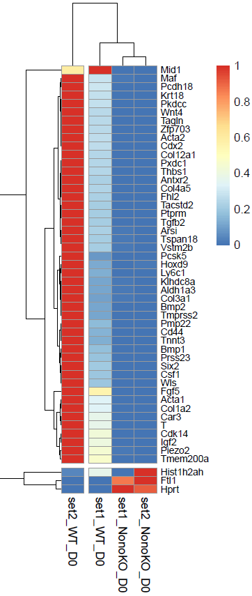​

​

进行 GO 富集和 KEGG 富集分析

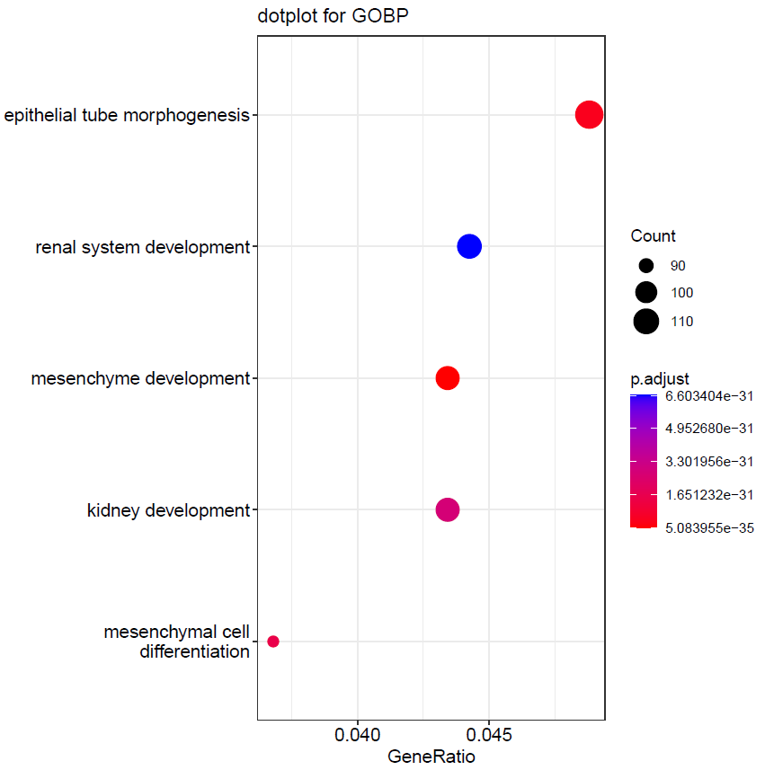​

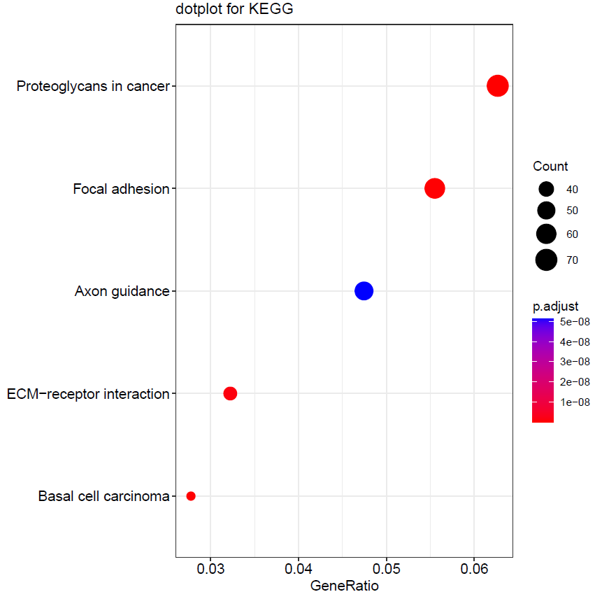​

通过 GO 的 Biological process 富集分析，发现这些差异基因主要在 epithelial tube morphogenesis、renal system development、mesenchyme development、kidney development、mesenchymal cell
differentiation 富集

通过 KEGG 富集分析，这些差异基因主要在 Proteoglycans in cancer、Focal adhesion、Axon guidance、ECM-receptor interaction、Basal cell carcinoma 等代谢途径富集

## 五、存在的问题

* trim_galore 过滤双端数据的时候，忘记加--paired 参数，发现 trim_galore 过滤双端数据生成的最终文件不是 trimed.fq.gz，而是 val_1.fq.gz 和 val_2.fq.gz.
* 一开始不明白 cuffdiff 的 gene_exp.diff 其中的 foldchange 是怎么计算的，四个样本输进去后会有 6 个组的比较，也就是说所有样本之间都进行比较了，包括 set1 的 WT 组和 set2 的 WT 组。后来经过助教的指导才发现自己没看仔细 cuffdiff 的使用规则，同一组的不同重复用逗号分割，不同组间应该用空格分割，说明无论做什么事情还是要仔细，不要一开始就犯错，理解有问题。

  ​​
* cuffdiff 的 log（foldchange）是 sample2/sample1，log（foldchange）>0 代表 gene 在 sample2 中上调，log（foldchange）<0 代表 gene 在 sample2 中下调。开始运行 cuffdiff 的时候，没有注意输入顺序，把 KO 放在了 WT 前面，造成上下调基因输出相反。
* 本次实验的样本量太少，set1 和 set2 同一组的 WT 小鼠的基因表达量差异也很大，GO 富集和 KEGG 富集分析的结果并不能说明什么，需要扩大样本量找到的差异基因才更有说服力。

‍
