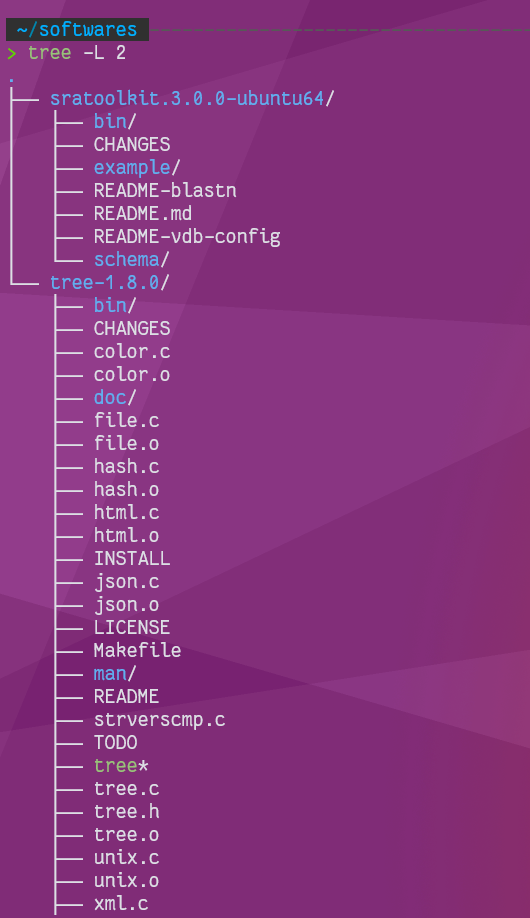

## 使用

tree能以树状图列出目录的内容，非常适合概览项目结构。

```bash
alias tree='tree -FCN'
tree -L 2
```

* -F 在执行文件，目录，Socket，符号连接，管道名称名称，各自加上"*","/","=","@","|"号
* -C 在文件和目录清单加上色彩，便于区分各种类型。
* -N 直接列出文件和目录名称，包括控制字符。
* -L 设置展开层级

​

## 安装

### Linux无权限安装

1. 通过链接地址: [http://mama.indstate.edu/users/ice/tree/](http://mama.indstate.edu/users/ice/tree/)下载 tree 安装包。或者使用wget命令：`wget http://mama.indstate.edu/users/ice/tree/src/tree-1.8.0.tgz`（版本不要安装太新的，可能编译有问题）
2.  使用指令 `tar -zxvf tree-1.8.0.tgz` 解压。
3. 进入解压目录，编辑目录中的 Makefile 文件，将 prefix=后面的路径改为自己的安装目录，比如我的改为 `prefix = /home/achuan/softwares/tree-1.8.0`，保存。
4. 在解压目录，输入指令 make install 进行安装。
5. 编辑用户目录(~）下 `vi ~/.bashrc` 或 `vi ~.bash_profile` ，加入以下内容：export `PATH=$PATH:/home/achuan/softwares/tree-1.8.0/bin`
6. 输入 `source ~/.bashrc` 或 `source ~/.bash_profile` 指令更新。

### windows Git Bash安装

* 打开进入 [Tree for Windows](https://gnuwin32.sourceforge.net/packages/tree.htm) 页面，选择下载 Binaries zip 文件。
* 解压压缩包，找到压缩包内的 bin 目录，将 bin 目录下的 tree.exe 复制
* 找到安装Git的文件夹，找到该文件夹下的usr\bin 目录，将 tree.exe 粘贴到该目录下，安装即完成