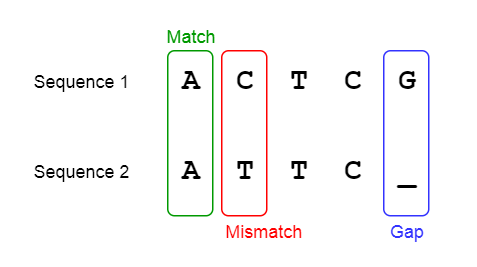
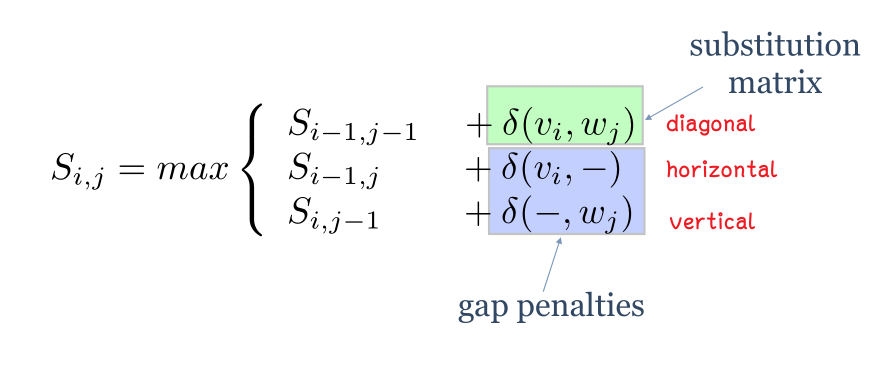
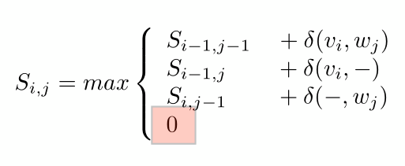
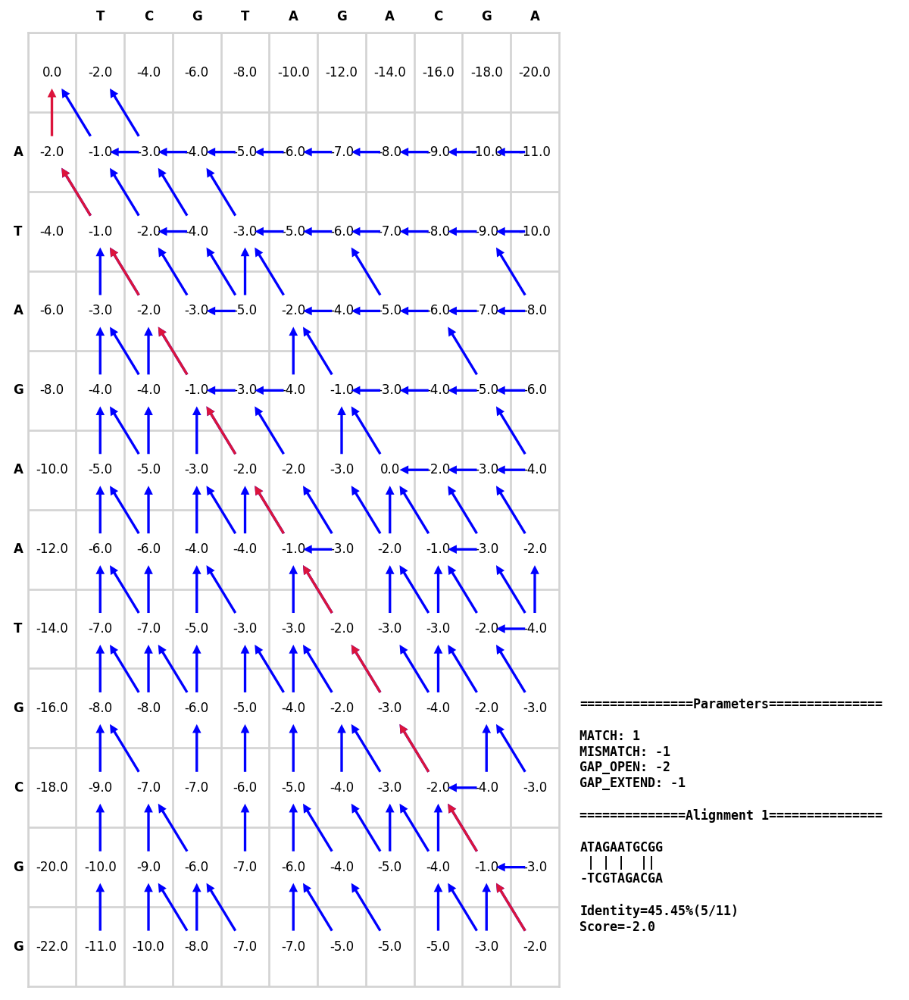
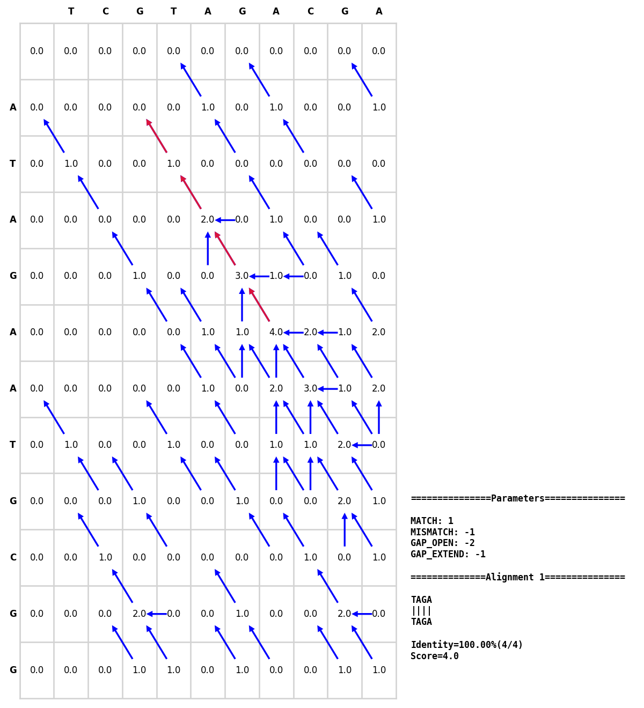

## Python实现

阿巛同学第一次较好的封装



## **简单介绍**

Needleman-Wunsch和Smith-Waterman算法都是Pairwise alignment算法，用于双序列比对。

* Needleman-Wunsch是全局序列比对算法，最终会得到2条序列在全局上最佳的匹配结果（e.g. 最多的match数量、最高的比对得分、最高的identity）
* Smith-Waterman是局部序列比对算法，最终得到的是2条序列在局部的最佳匹配片段（注意：即挑选出得分最高的比对片段）

## **算法实现介绍**

两个算法都是用了动态规划算法，什么叫动态规划呢。先思考下，若我们想要得到两条序列间最佳比对结果的话，你会怎么解决，穷举法？但是此方法需要穷举的次数随着序列长度的增加而不断增大，而且要考虑两条序列在哪里插入空位，比对结果的长度范围为n(两条序列完全匹配上)-2n(两条序列均对到空位)。

比对序列的长度越长，需要穷举的次数越多，这对我们来说将会耗时很多，这是不太现实的。所以我们需要一种新的方法进行比对——动态规划。动态规划算法是一种求取最优解的方法，该方法通过将问题拆解为若干子问题，求取子问题的最优解，所有子问题的最优解合并即为全局最优解。

下面具体介绍下两种算法的细节。

这两个算法都是先建立一个打分矩阵，考虑每个cell从各个方向的来源得分，记录最大得分的来源，最后按照规则回溯，从而得到比对结果。

### 来源方向

来源方向有三个：横着来的horizontal，竖着来的vertical，对角线来的diagonal，其中horizontal，vertical对于gap，而diagonal对应mismatch和match（diagonal来源的比对可以是确实比对上，也可以是强行比对）。

​

### 打分矩阵

对于全局比对的Needleman-Wunsch算法而言：就考虑来自三个方向的分数情况，记录最大得分的来源

​

而对于局部比对的Smith-Waterman算法而言：还需要考虑得分>=0，如果得分少于0，则不记录方向。

> Attention!
>
> * 对于diagonal方向的**得分**，有两种方式
>
>   * 一种就是看两个碱基match不match，match就+x分，mismatch就-y分
>   * 一种是替代矩阵M，M[A][B]为得分，经典的替代矩阵AM250和BLOSUM62，其中PAM250是基于高同源序列构建，BLOSUM62基于远程同源序列构建，因此寻找远程同源序列一般用BLOSUM62。
> * 对于vertical和horizonal方向的**罚分，**也有流行的两种方式
>
>   * 一种是线性罚分，出现一个gap，我就扣k分
>
>     * 举例，设置gap_open=-2。连续出现三个gap的罚分就是$-2\times3=-6$
>   * 另一种叫affine gap penalty，翻译叫仿射罚分，即在打开第一个gap的时候引入gap open罚分，而在该gap的基础上进行延续则采用gap extension罚分。之所以这样做，相比从生物学原理来说，应该更倾向于仅出现一段长gap而不是多个短gap。
>
>     * 举例，设置gap_open=-2,gap_extension=-1。连续出现三个gap的罚分就是$-2+(3-1)\times-1=-4$

### 回溯

Needleman-Wunsch就是头对头、尾对尾算法，所以会从最右下角进行回溯

​

Smith-Waterman只考虑找出最大得分的比对结果，所以会找出最高分的位置，开始回溯，直到cell的分数为0结束

> Question： 回溯时，横着和竖着的方向代表存在gap，那怎么知道gap是在哪条序列上呢？
>
> Answer：看方向，垂直箭头的那个序列，就在对应碱基前加一个gap。比如横着的箭头，说明左侧的seq存在gap，竖着的箭头，则是顶部的seq存在gap。

## 总结

| |Needleman-Wunsch |Smith-Waterman|
| ----------------| -----------------------| -----------------------------|
|比对方式|全局比对|局部比对|
|初始化得分矩阵|第0行和第0列置GAP罚分|行列全部置0|
|得分方式|允许负分|负分置0|
|回溯方式|右下角->左上角|最高分开始->位点分数为0结束|
