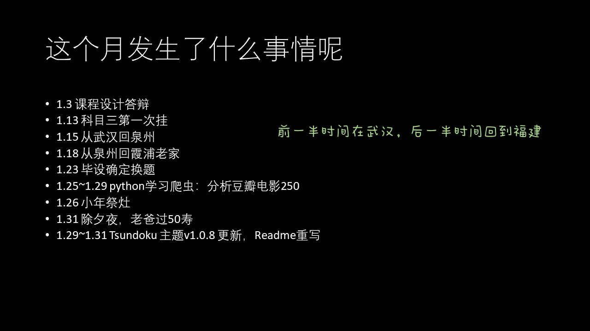
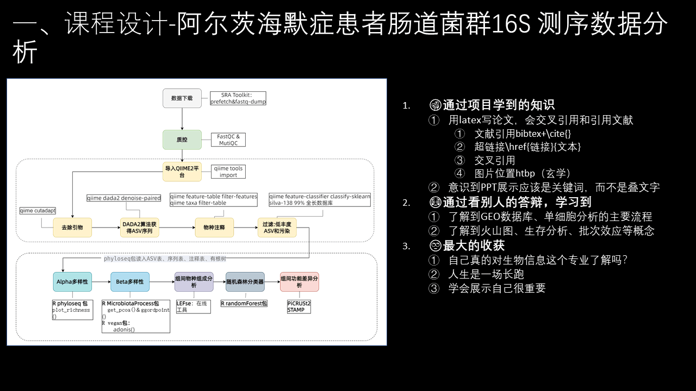
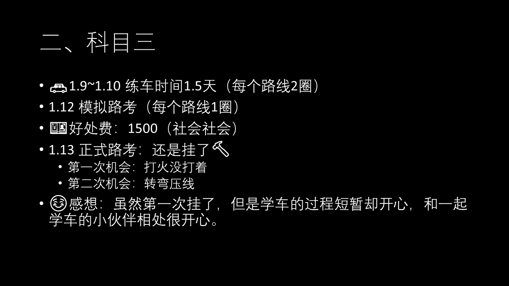
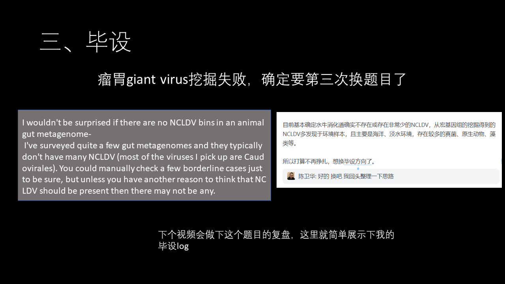
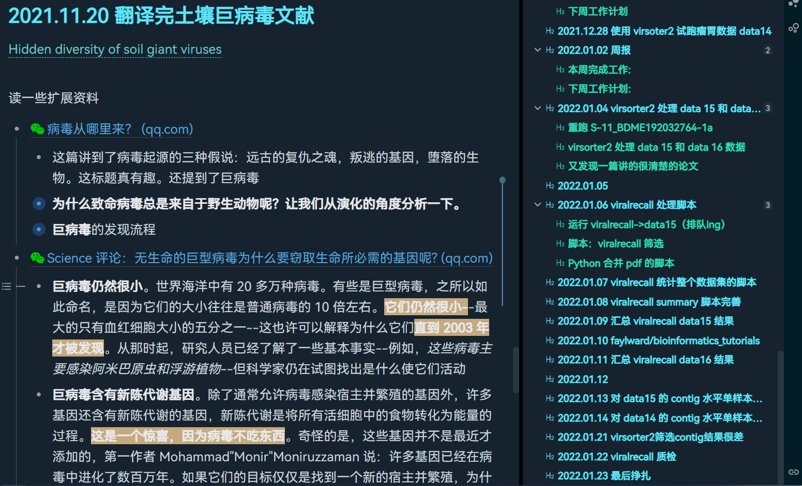
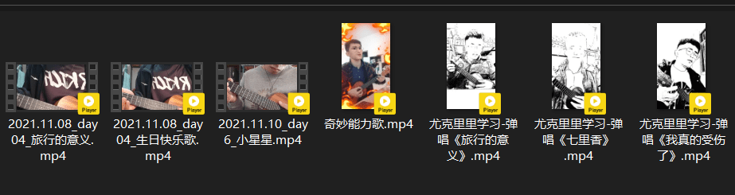
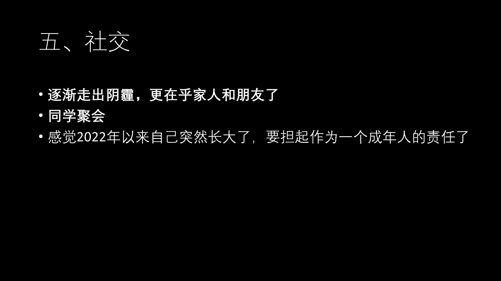
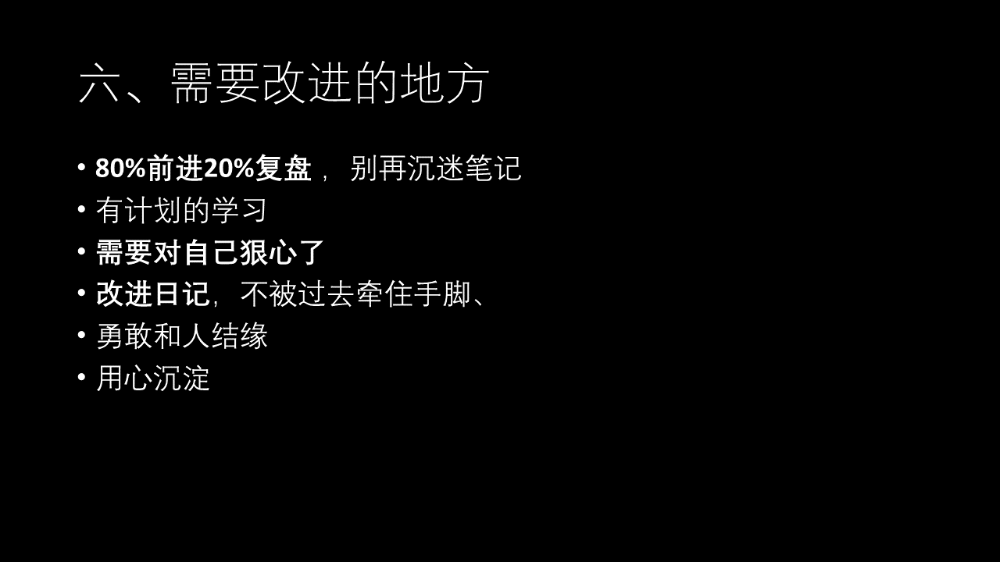

未来的阿巛：

你好

以后的每个月我都打算写Monthly Letter，希望自己能坚持下去。

首先回顾下自己这个月遇见了哪些事情吧？

总结下就是前一半时间在武汉，后一半时间回到福建。月初先是搞完了课程设计答了辩，然后之后一边继续做毕设，一边报了科目三，然而就不出意外的挂了。1.15就从武汉回到福建了，后面毕设实在搞不出结果，和老师说了要换题，然而你不知道的是前面我已经换过一次题目。由于暂时没事情做，就整理了下python笔记，第一次接触爬虫，爬了豆瓣电影Top250页面并仔仔细细做了数据分析。之后就是准备过年啦，小年祭灶，除夕夜，今年还是老爸50寿，热热闹闹的，很开心。总体来说，我的一月份还是过的挺充实的。

接下来呢，就简单复盘下这个月遇见的一些事情吧

‍

## 一、课程设计

第一部分，复盘下生信课程设计，这是我本科最后一门课程，内容就是自己选一个生信课题，独立完成，写报告、做ppt并答辩。我的课程设计题目是阿尔茨海默症患者肠道菌群16S 测序数据分析。很惭愧的说，这个项目算是我第一次完整做完的生信项目了，通过这个项目呢，我学到了16S测序分析的整体流程、用latex写论文，会交叉引用图片和引用文献，意识到ppt展示应该是提取关键词，言简意赅汇报你的重点，而不是把报告的一坨文字复制粘贴过去。通过看别人的答辩，也了解到GEO数据库、单细胞分析的主要流程，了解到火山图、生存分析、批次效应等概念。但我最大的收获有3点，

* 第一点是，自己真的对生物信息这个专业了解吗？这次课程设计才算自己完整做的一个项目，为什么以前有那么多的时间却不好好学习锻炼能力，总是逃避呢
* 第二点，是意识到人生是一场长跑，大家都在一步一步前进，自己也不能懈怠，不然就落后了。要利用好实验室和身边的资源，努力多学多做一点事情。保了研之后不得不说我懈怠了很多，但我现在渐渐意识到保研并不意味着说你的大学生涯已经提前到了终点，相反，这是一个新的开始，我必须尽快确定自己研究生要做什么并提前准备。也意识到时间很宝贵，应该用在有意义、能帮助自己增长技能、增加资本、赚更多钱的事情上面，而不是自娱自乐玩电脑刷社交软件看评论区。
* 第三点是，学会展示自己很重要。课程设计答辩上，就算有些同学的内容可能并不是自己做的，但人家依然能自信满满、有逻辑的展示这个项目的内容。而这真是我所欠缺的，从前的我很畏惧上台，很畏惧展示，现在才明白，你有能力做一件事是一回事，你给别人展示你能做了这件事又是另一回事，一定要学会自信展示自己的成就，真的不要谦虚，把机会拱手让人。

关于这个课程设计项目的内容我之前就已经做了视频了，也把分析代码和报告全部上传到Github了，有需要的自行跳转

## 二、科目三

第二部分，回顾下科目三

我是在武汉报的，我是真的没想到科目三只有1天半的练车时间，每条路线2圈。

然后1.12模拟路考，每条路线练了一圈。关于科目三的好处费，我也很无语，教练和我们说最低档1500，交了不一定能过，不交一定过不了，这就是社会这就是现实吧，那我就只能屈服交钱了。1.13 正式路考，前面已经说过了，我挂了，有两次机会，第一次机会，我死在了打火没打着，第二次机会，我死在转弯压线上……本来上车之前我就和同行的人说能跑多远是多远，想不到还是没开多远就挂了。

但是呢，虽然挂了，我依然觉得这次学车的过程短暂且开心，和一起学车的小伙伴相处很开心，大家互帮互助，这真的是我在学校，在班级所不能体会到的快乐。还有就算其实我大一下就报了，然后在大一考了科目一、科目二，由于后面疫情，之后就一直拖，拖到大四下，当然也不仅仅是疫情啦，还有我胆小懦弱逃避现实的缘故，可是真的去学了，就发现其实没有那么可怕，自己也很快就上手了（虽然挂了……）。所以会渐渐觉明白，很多事情，你不去尝试，永远都不知道你能不能做到，最怕的是你连失败都不敢。

## 三、毕设

第三部分，复盘下失败的毕设

我现在的毕设题目是在瘤胃动物的消化道挖掘giant virus，结果挖掘来挖掘去，还是挖掘不到病毒，就和老师说了要换第三次题目，现在还在等第三次题目，下个视频会做下这个题目的复盘，这里就简单展示下我的毕设log。

## 四、尤克里里

第四，复盘下尤克里里学习

买尤克里里算是我最正确的一次投资了，弹琴噪声扰民非常快乐，我花了一个月时间学《七里香》，对的，2021年12月就学了这一首歌，1月初才学完，然后这个月学歌就快了，学习弹唱《旅行的意义》，《我真的受伤了》，《奇妙能力歌》

## 五、社交

第五，回顾了自己的社交状态

12月的时候由于喜欢的某个女生突然毫无解释的删了我好友，并且我尝试加了她三次都被拒绝了，真的一点解释都没有，让我挺受伤的，你可以勉强理解为失恋吧，所以之后一段时间都不是特别开心，这个月才逐渐走出阴霾，也变得更加在乎家人和朋友关系了。

回到老家后，遇见了一些小学、初中同学，发现我绝大多数的同学呀都是初中毕业、高中毕业就开始进入社会打拼了， 做美容、房屋中介、工厂上班、做厨师，有的人已经买了车、买了房、结了婚、有了孩子，我真的觉得他们都比我活的精彩。而像我这样读完大学还打算去读硕士的人可能不超过3个，相比别人这么早就出来打拼，我开始有点怀疑，自己的大学是不是一直虚耗时间，自己还没准备好面对社会、面对现实，面对赚钱养家的责任了。但，反正已经走了这条路呢，就踏实走下去咯，就是觉得以前太挥霍时间了和青春了，希望今后改进下，也想活得精彩些。

感觉2022年以来自己真的突然长大了，想要担起作为一个成年人的责任了，也开始思考如何养家糊口了

## 六、个人管理反思

第六部分，是反思下自己需要改进的地方

第一点是，我看到这样一句话非常扎我的心，“整理东西本身并不能产生太大的价值，除了耗费时间。整理只是路径，而非目的；真正的目的在于，我们在某个领域又进一步精进了、又做出了什么项目。”但是你知道吗，我过去一直很沉迷于寻找和讨论笔记软件，在笔记以及软件上花了非常非常多的时间，现在回想起来非常非常懊恼，如果把这些时间用于做项目、学技能该多好。现在我会打算往项目为导向输出这个方面来前进，把80%的时间用于前进，20%的时间用于复盘，希望自己一定要做到这点，并做好

第二点是，要**有计划的学习**，一定是主动地去接收知识，而不是随机漫步。要有目的和计划的去学习知识和技能，而不是一整天漫无目的刷知乎、刷B站，白天努力学习，晚上放松充电

第三点是意识到**需要对自己狠心了**：我不知道为什么，我会给周围的同学留下自己很厉害的印象，我自己却一直很清楚，我是一个学东西很慢的人，我就是不如别人机灵、见机行事。感觉上大学以来自己非常的吊儿郎当，比起别人精彩的大学生活，我基本宅在电脑前，编程技能也一直原地踏步，没学着去做正经的项目，真的该对自己狠心，在大学的最后一个学期争取做一些事情，弥补一些缺憾

第四点是**改进日记**，不被过去牵住手脚：我目前用双链笔记dailynote流程来记录日记，但以前的日记可能还是会倾向于流水账事无巨细的记录，花很多时间伤春悲秋，记录无意义的牢骚。现在会想着说今天的事情做的怎么样，之后如何做好，更在乎未来。“放下执念，和过去的自己握手言和。展望未来，竭尽全力去开创新的世界” 不要再被过去的好坏牵住手脚，大步向前走呀。

第五点是**勇敢和人结缘**：以前会认为，人丑应该少说话，可是看了那么多B站up主，其实很多人也不是那么好看，但是人家就是特别自信，特别会展示自己，以致于你只在乎他的内容与才华不在乎长相了，所以啊，还是要勇敢的露脸，在现实和人打交道吧

最后一点是要**用心沉淀**：以前会比较喜欢发空间和朋友圈，或者找人聊天分享，现在可能会更倾向把琐事记录在flomo，因为会意识到要厚积薄发，而不是盲目在输出，也要开始学会延迟满足了

## 七、Up主计划

最后，想当Up主，打算录制vlog、经验分享类视频到B 站，分享和记录自己的生活和想法，多多寻找自己真心喜欢的东西，去创造东西，找到更多兴趣相投的伙伴，丰富经历。并且以教为学，增加自己的表达能力和展示能力！！

这就是这个视频的全部内容了，下个视频再见

‍
