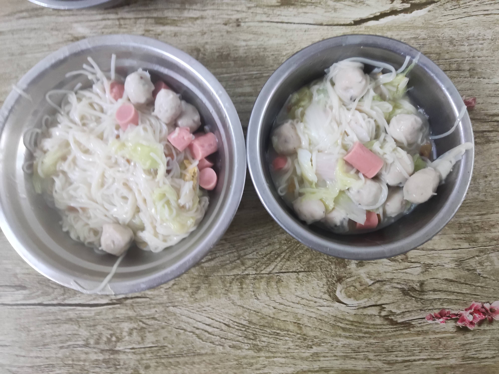
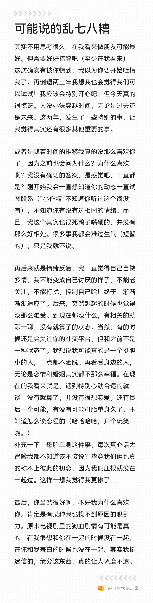
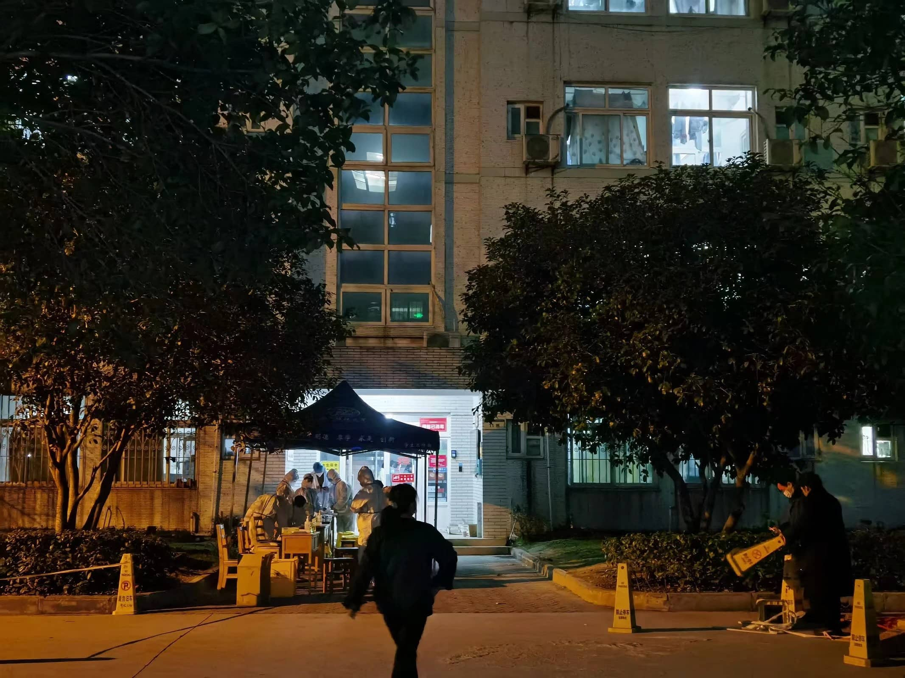
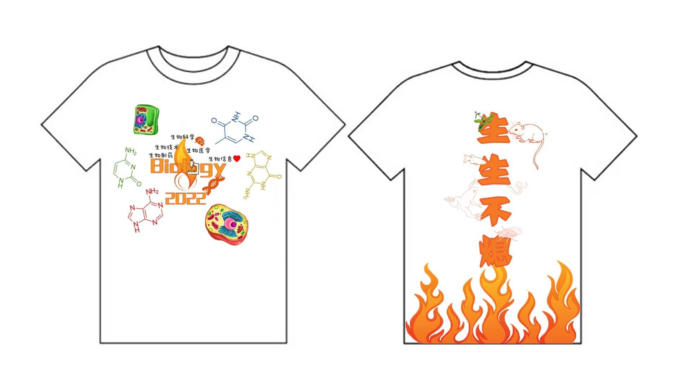
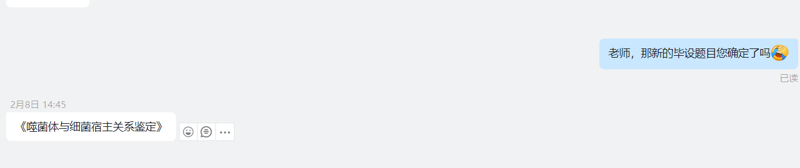
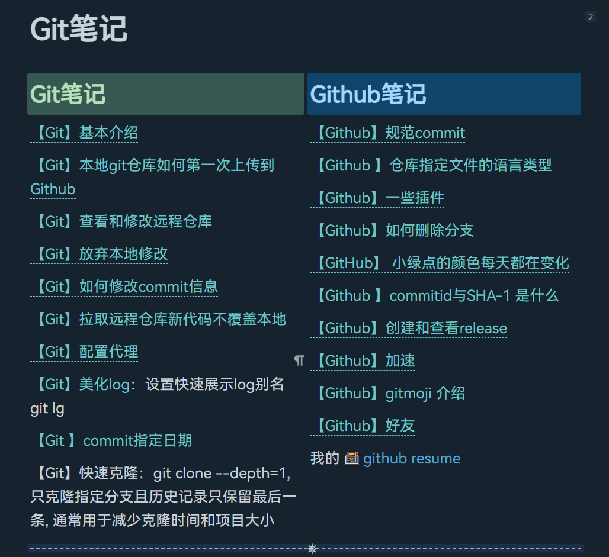
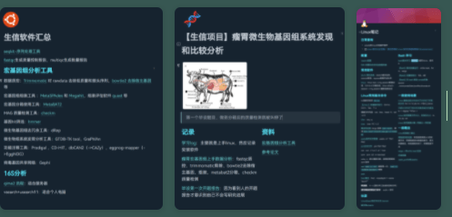
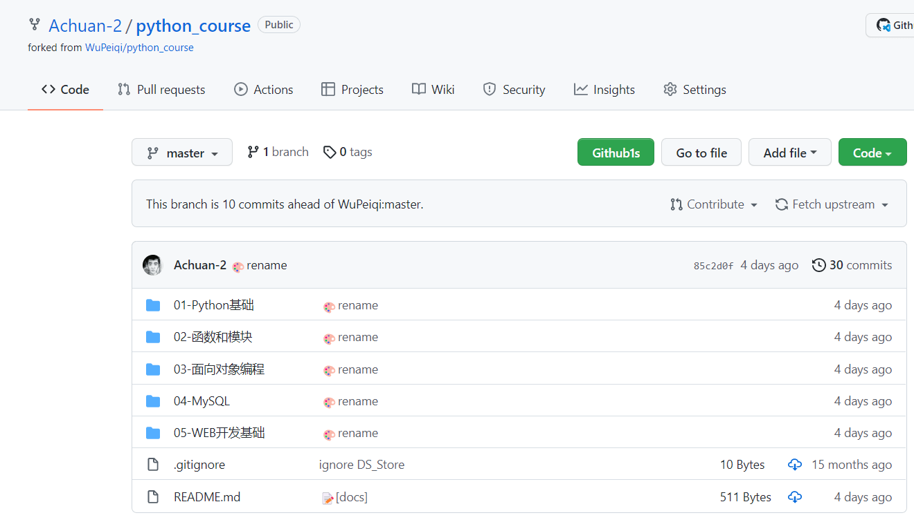
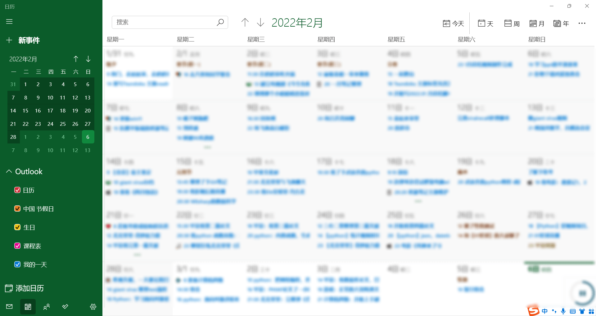

# 【Monthly Letter】2022.02 冬奥｜确定第三次毕设题目|和飞燕见面

未来的阿巛：

你好

和上个月总结相反，我基本是前半个月在家里，后半个月就回到武汉了。

## 社交方面

前半月在家里还是挺开心的，怕辣的自己和家里人吃了几顿吃海底捞底料的火锅、几个表姐来家里做客、阿婆的90寿酒席遇到了很多大坪祖籍那里的亲戚、去晋江表姑家；

还鼓起勇气和初恋约见面、那天晚上两个人边走路边聊聊了很久，第二天坐动车去泉州，在车上我跟她表白啦，不过还是被她拒绝了；

回武汉之后由于武汉有了疫情，开始封校，食堂开始分进口和出口，进入教学楼要带口罩了。有几个宿舍楼还被封了，每七天就要做核酸

月初北京冬奥会开幕啦，自己有看点花滑视频但没怎么了解冬奥项目，觉得自己没有机会接触这些吧；电影重温了《四月物语》，因为电影最top解说而看了《死神来了》第一部和第二部。

参加了学院的毕业文化衫设计，就是去凑热闹，有什么元素就加什么元素，觉得差不多了就直接提交了

学习方面呢，毕设确定了新题目是《噬菌体与细菌宿主关系鉴定，回到学校之后呢，开始看论文了，目前我还在看论文的阶段，目前的任务就是自己搞个标准的噬菌体数据库，然后开发新的算法找噬菌体和细菌的关系。可能是因为换了两次题目，导致自己现在有点沉不下心来搞毕设。

## 个人

我整理了Linux和Git笔记、还有自己自己搞宏基因组、16S的笔记，发现整理笔记的话重要的是言简意赅，只是光整理的话没有什么意义，除非你这些东西能用助于你前进，我还是应该要好好学习用80%的时间前进20%复盘

前段时间花了挺多时间学习武沛齐的python教程的，对我又重温python语法了，真的学到很多之前没注意到的东西的，但同时也意识到自己应该多用代码写东西，而不是总在纠结语法啦，多实践多创造吧。

开始用微软日历坚持每天记事啦，记录每天遇见的事情

## 最后的感悟

最后一点小感悟是不要自我设限，要学会多遇见不一样的人、不一样的生活方式，多做一些能给自己简历添彩的东西，少一些自娱自乐，要像那些up主一样，做好自己本职任务的同时，心里放着几个小项目，去每天一点点实现ta，有自己的喜欢做的事情并长期坚持，我觉得这是非常棒的事情

好了，这次月总结比较简单，因为我也不想废话太多，也没什么改变，这个月一定要更好呀更开心，希望自己毕设能赶快进入正轨多学点东西，武汉疫情快点安稳下来周末自己能多出去走走，我还要考驾照呢。这个月还要考计算机四级，虽然是没什么意义的证书，之前我没有过心里就不甘，这次一定要过呀。

‍
