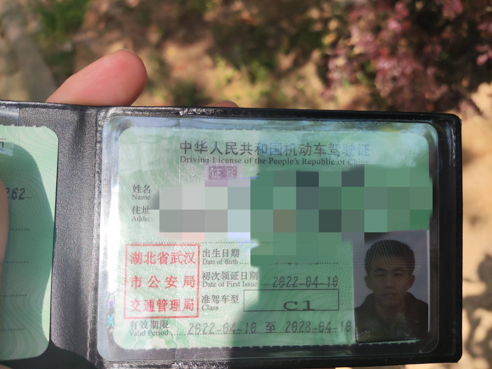

> “苦难既然把我推到了悬崖的边缘，那么就让我在这悬崖的边缘坐下来，唱支歌给你听”

未来的阿巛：

你好，抱歉，这段时间太忙了也太累了，以致于四月并没有给你写信，只好干脆拖到5月的最后一天，想着干脆一起写信给你了。

其实这两个月我还经历了挺多事情的，经历了很多第一次，这些事情给我产生了很大很大的影响，所以这些事情未来的你还记得嘛？

## 毕设

还是先说最重要的毕设吧。

4月份的时候，我其实没有怎么搞毕设内容，而是忙于复现一篇NBT文章，这篇文章提到了一个agreement和purity指标，毕设指导老师希望我能够复现这篇文章，看看他的数据是否有问题。我下载了文章中提到的数据库，用文章提到的软件来复现，文章对于参数的描述非常含糊，我是一个个去发邮件询问的。这篇文章的复现我花了三个礼拜的时间，等做完之后已经是月底了。这时教务科开始通知论文在5月8号要查重，而那时我还压根不知道自己的毕设到底要做什么。

孙楚晴师姐给我指点了下，示意你用她之前的crispr、blastn、prophage的脚本，画个ROC图，评估哪种方法好。但是我发现ROC图效果并不好，而且三种方法是应该联用，而不是选择哪种方法好。于是自作主张改成用常规的三种序列比对方法来预测并评估效果，然后开发方法从这些预测的噬菌体-宿主关系对减少错误，更好的确定噬菌体的宿主范围。我在四月的最后一周快马加鞭基本完成了这些分析。

到了5月，第一周，我完成了毕设论文初稿，在5月8号这天我才知道下周日才截止查重，于是我又花了一周时间完善论文，第三周我主要在慢慢吞吞补毕设材料，第四周是答辩周，由于之前我和老师提了嘴优秀毕设的事情，结果他真的把我推荐为系的优秀毕设去参加院系答辩了，虽然我自认为自己的工作特别水，但是抱着陪跑的心态还是硬着头皮参加了。老实说，我答辩的表现并不好，一方面答辩的稿子没背熟悉，有点小卡壳，还以为不限时间特意多展开了点，导致讲超时了，说时间到10分钟的时候你还愣了一下，没缓过神来，没把最重要的总结和展望讲下来。提问环节表现就更差了，由于台下基本都是生科、生技的老师，我讲的方法他们听不懂，一个老师怼着我问做这个对湿实验的意义，可能是你太过在乎背自己PPT的稿子了，虽然我论文写了计算方法可以为湿实验提供重要参考，但是我支支吾吾并没有说出来，反而是脑子抽筋说了实验方法受制于噬菌体和宿主是否培养这句话，然后评委就问你既然不能培养的话，那做这个还有什么意义呢……然后整个提问环节就被越带越偏。虽然提问环节的失败和底下评委没有生信老师有一点点关系，但归根到底还是我明明提前知道评委的专业分布，却没有针对性改善自己的ppt内容，没有重点突出自己研究的重要意义，反而太执着于想要展示自己的工作内容，导致评委听不懂我的工作，也不知道工作意义。还有我的presentation实在太差了，只要问到我没有事先背的东西，就无法流利的表述自己的想法。最后的结果是班上四个人参加优秀毕设答辩，伊龙雨和赵子文拿到了优秀毕设，而谢昊和我没有拿到。经过这件事和之前复旦脑转化夏令营失败的面试后，想必未来的你有痛定思痛，有好好训练提升自己的presentation能力吧，能够针对特定的人做出有针对性的presentation。要知道做的怎样是一回事，怎么和别人展示又是另外一回事呀，不然你就永远都走不到台前了呀。

## 其他进展

好啦，不讲难过的事情，讲点开心的事情吧。这两个月，除了毕设，我还有其他方面的进展哦

* 4月10日，我过了科目四，总算拿到了驾照。说起来，我是大一下报的驾校，大一下过了科目一和科目二之后就一直没再练车了，这有疫情的一部分原因，但归根到底还是自己有点逃避吧。大四下才总算接连过了科目三和科目四。所以现在的我有开车上路嘛，还是依旧骑着单车逛街呢，哈哈哈。

  

  
* 5月7日，计算机四级成绩也发下来了，过啦，这门考试总算可以翻篇了哈哈哈。
* 5月25日公布优秀毕业生名单，里面有我哦，应该是大学阶段的最后一个荣誉吧，能能拿到也很开心

  【[华中科技大学2022届优秀毕业生名单](http://bks.hust.edu.cn/info/1052/2033.htm)】
* 然后这两个月尤克里里学习弹唱方面，我学习了《斑马斑马》《今天你要嫁给我》《小手拉大手》《告白气球》，扫弦稍微有了那么一点点进步，也开始尝试用腹部来唱歌了，虽然还是没能摸到门道的瞎唱。

## 遇见

最后，回顾下我在这两个月的遇见的人和事情。

4月10日，Chenlab实验室从启明学院搬到了东十二七楼，陈老师总算有自己的房间，不用再听到他和别人开会议的声音

5月19日，我把12个思源笔记永久激活码卖了，赚了5300，也算是你的人生第一桶金吧，这些笔记重度用户可真舍得花钱，还剩最后一个永久激活码想要先囤着。

5月20日，520这天，我参加了毕业歌曲《如愿》的MV拍摄，充当群众演员，现在MV估计还在后期剪辑中，还不能把成品给你看，这里就放几张我偷拍的照片吧。当天晚上Chenlab实验室还举办了Housewarming party，这天我玩的很开心，先玩小游戏，转圈抽奖，还抽到了最幸运的奖，每个人都得给你发红包。游戏过后，听着师兄师姐们唠嗑，聊实验室、聊生活、聊未来。

5月21日，我之前删除的班级好友全部都重新申请加好友了，为什么我会把班级同学都删了好友呢，简单说就是心情不好，往深层的原因说一是你是高敏感的人你觉得没和他们成为朋友二是我一直就有删好友这个臭毛病，以前的同学其实也给删的只剩下要好的几个了。想必未来的你认为删好友是很愚蠢且很难挽回的行为，想要一个人清净清净，大可以把好友动态给屏蔽，为什么非要删除呢，这件事之后，你暗暗对自己发誓，以后再也不要这样玻璃心了。

第二天，我在班级群发了每人6.66的红包，希望大家答辩顺利，也表达下自己之前删好友的歉意，但只有11个人领了。其实你发红包只是为了让自己心安

5月23日，靳瀚博师兄毕业，送了大家每人一个小警句。你跳了“重剑无锋，大巧不工”，希望自己能够注重基本功夫的培养，不要只在乎表面上的文章。

5月25日，早上11点我给陈老师和孙楚晴师姐试讲了毕设答辩，结果被批讲的太细节；下午我参加Nilab的组会，又再次讲了毕设答辩的内容，结果被指出讲的太快，没有细节，所以还是要学会对不同的人不同的场合做出不同的展示啊，这点得好好学习

5月27日，是院优秀答辩，前面已经提到过了，答辩之后我和伊龙雨、赵子文去了周麻婆吃饭。这也算是我第一次和生信基地的同学去餐馆吃饭。

5月28日，我第八次参与成分献血，一件大事结束，第二天去放血好像已经成为了我的习惯了。

5月29日，我去拍了证件照。大学四年你一直用的是高中的照片，总算下定决心去拍个证件照，还特意挑了西装款的。当天下午靳瀚博师兄还邀请实验室的人一起唱KTV，这是你第一次去唱KTV，虽然唱的不好，但唱的很痛快，还唱了《奇迹再现》《小英雄大肚腩》。老实说，大学里，我没有融入进班级，但在Chenlab才稍微有了点融入集体的感觉。未来的你，有了一个可以约饭喝酒唱歌的小团体了吗？

5月30日，我去校医院拔了蛀掉的智齿，当天需要把口水和血水都吞下去，非常恶心，你当时好几次都差点想吐，不过长痛不如短痛，希望以后还是好好刷牙，注重牙齿健康呀，不要再看牙医啦

5月31日这天，是五月的最后一天，这天学院安排了拍院毕业合照

## 一点小感悟

最后是这两个月重要的一点感悟。 

做毕设的时候，我看了吕艺青她们的大创文件夹，才逐渐意识到，自己之前花了太多时间在自娱自乐了，不管她们做的怎么样，但总是有在做一个项目，而我之前总是在逃避一些明明很重要的事情。班级里很多人都很优秀，女生里有很低调的潘雯、很高调的吕艺青、很努力的张爽、很稳重的谢昊、男生里有很潇洒的张浩博、很优秀的赵子文、很会组织班级的徐伟、很乐天的伊龙雨、很有自己想法的王千。过去的你，总是逃避和这些优秀的人相处。是真的需要静下来认清自己的能力，学会对自己坦诚，多学多请教别人，然后好好努力，一点点进步吧。

生活的真相是，我们无法让玫瑰丛没有尖刺。我们能做的是，与其抱怨玫瑰丛长满了刺，还不如感激刺丛里竟生出了玫瑰。你的不幸来自于抱怨，你的幸福来自于你的感恩。阿巛同学，你要学会感恩遇见的人和事情，事情已经发生，抱怨并不能改变什么，但感恩可以让你更快乐，过的更舒心。过去的你，常常用消极的眼光看待生活、看待自己、看待别人，恶意地放大阴暗面，我希望从今往后，你开始感恩拥有的一切，在接下来的每一天，拨开乌云，拥抱真实的生活，拥抱真实的自我。

不管未来怎么样，希望你能永远发着光，点亮周围！

好啦，这两月你拿到了驾照、拿到了优秀毕业生荣誉、搞完了毕设、尝试了很多第一次，和更多的人相处，总之还是很棒的。

日子过的真的好快，一天天的转眼就过去啦，就希望自己要把日子过的充实有意义且快乐呀，能够找寻到生活的意义和乐趣。

目前毕设做完了之后，貌似自己对未来还没有什么计划呢，是想要好好精进下编程能力，还是搞复旦脑转化那边的项目，还是同时搞，希望自己尽快决定下来吧。

下个月再写信给你咯，现在的你过的怎么样呢？有空的话也写信给我吧

阿巛

2022年6月5日

‍
