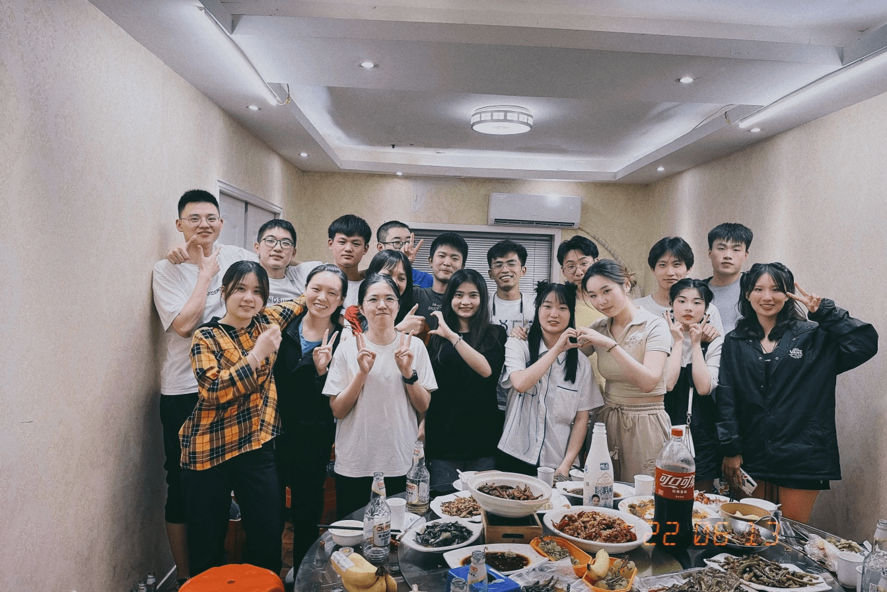
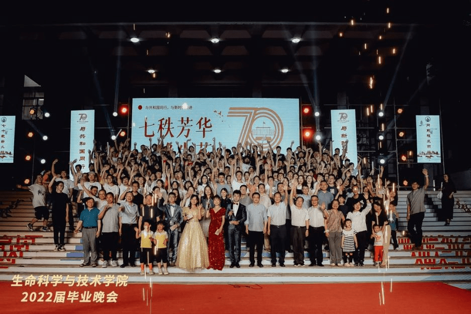
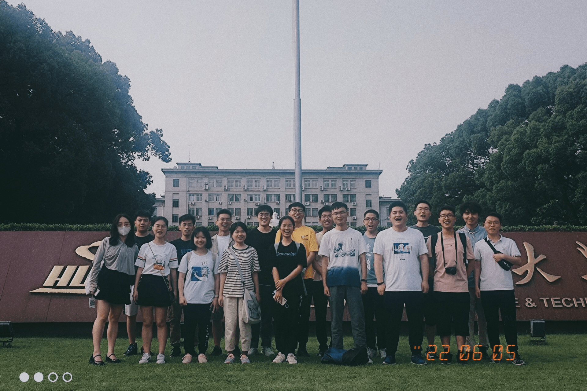
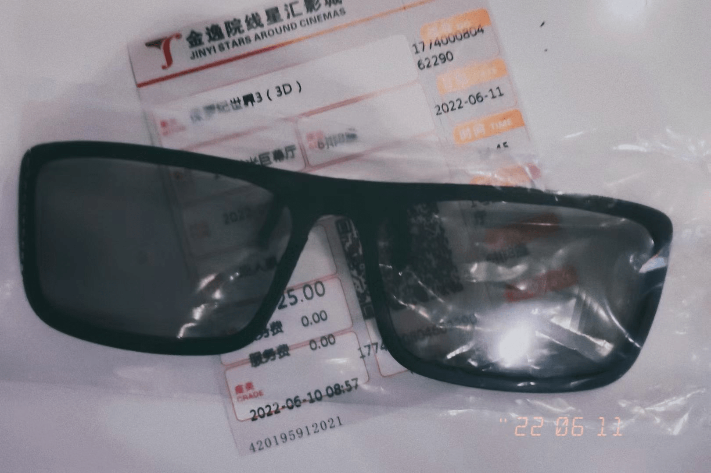
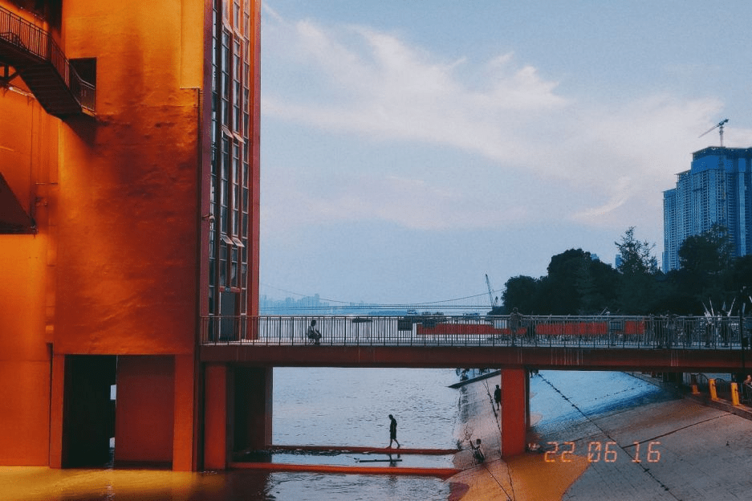

> 如果我会发光，就不会再害怕黑暗

## 本科毕业

6月，是毕业季。我将毕设资料袋上交给了老师，电脑上的毕设资料也整理封档了，上传到了GitHub。毕设总算是结束了，做毕设前期累的要死，中后期就开始划水了，虽然没拿到优秀毕设，但是已经满足了，不追求太多，反正毕设题目也没有什么东西。老实说，黄士娟说自己的毕设很水，自己的又何尝不是呢。其实自己之前是想要找机器学习的题目的，结果被陈老师逼着做了三个题目，体会了一把社畜的感觉，而且感觉自己没学到什么，都是一种瞎折腾。学到的主要是一些工具的使用，blast，crispr等工具的使用，而不涉及生信传统的组学分析。现在回过头来看，觉得毕设对我最大的意义是，遇见了孙楚晴师姐、靳瀚博师兄等等实验室的师兄师姐，第一次有了融入集体的感觉，算是大学最美好的回忆了吧。虽然因为心里受伤，自己没有太主动拉近与他们的关系，已经满足啦，挺好的。

说一点毕业相关的活动吧。

* 班级聚会：毕业晚会由于下雨延迟，原定的那天改为了班级聚会。聚会其实人来的不多，伊龙雨寝室、柯怡寝室、张爽都没来。分了两桌，我和潘雯、高艳、李攀、吕艺青坐一桌，谢昊、朱莎莎、黄士娟、王千、关路津、黄新荷等人一桌，碰巧和对面那一桌的人都有心结哈哈哈，和自己的桌倒没有心结，或许是大家心照不宣的坐吧。（为什么会有心结呢，和谢昊是有情感纠葛，和其他人更多是合不来吧，加上之前删好友，就算别人能原谅自己，自己一直也有一个心结，哎，以后再也不删好友了，感觉对我来说真的是不可挽回的事情，虽然或许别人不在意自己。）聚会其实自己一直在喝酒吧，喝了三瓶，微微头晕，看起来比想象的酒量还更大一点。我主要就是和潘雯、高艳在聊天，聊聊各自毕设在实验室的情况，吐槽下老师。最后聚会拍了一张合照。这个文档整理了班级的毕业去向，不知道未来的你会不会用的上吧，或许只是自己的整理控发作。

  ​
* 毕业晚会：我当了生科院毕业晚会的志愿者哦，有幸做了一点点微小的工作，比如搬运物资、打气球、当颁奖礼仪。晚会很精彩，同学们都很有才华，见证了刘凡、付翔飞、吕艺青、苏琼玫等几位大佬的组织能力，从策划、筹备节目、联系舞美、搭建舞台、安排分工、布置现场等等，本围观群众都觉得好辛苦。

  ​
* 毕业礼物准备：我还心血来潮，给班级和实验室送了毕业礼物。班级是送了印章，实验室是送了福建零食大礼包（优之冻，鸭脖，菊花茶）。为什么要送礼物呢？我就是想让毕业有一份仪式感，也为之前高中没送别人礼物而弥补一点遗憾吧。其实我心里知道别人不太可能送我礼物的，毕竟大家没那么熟。我收到的毕业礼物蛮打蛮算却只有学生会幸运中的大礼包，还有杨凡请客送的汉堡吧。还是挺满足的，不要总抱怨自己没有什么，应该多看看自己拥有什么吧。
* 毕业典礼：最后一项也是最重要的就是毕业典礼啦，举办的日期是2022年6月22日，我呆呆地穿着学士服，拍了像电视剧里一样的把学士帽向上甩的照片，以及万年不变的比yeah手势；和全校毕业生们一起唱《晴天》；被院长拨穗；和其他同学一起拍了些合照（其实几个）；最后呢，领了双证。

## 游山玩水与吃喝玩乐

好了，上面关于毕业的事情说完了，就讲点娱乐的东西吧

* 06.05 我参加了福建老乡群送毕活动，其实就是一群陌生人，聚个餐，其实你感觉老乡算是个奇怪的东东，就算不认识，但因为来自同一个省份，就觉得额外亲切，而且福建人的老乡情结感觉还挺重，虽然各自的方言都听不懂哈哈哈哈。

  ​

  ​

* 06.11 是我第一次进电影院，看的电影是《侏罗纪世界3》，老实说电影不咋样，你去之前就知道，之所以还去，只是因为那段时间也没啥好电影，为了不浪费师姐送的电影票，也为了破“电影院处”，你总算走进了电影院。选的是3d场，买了3d眼镜，感觉和墨镜好像欸，影院看电影与自己看，最大的差别是，有人陪你一起，恐怖的地方一起屏住呼吸，搞笑的地方一起笑，还会有人在旁边科普你不懂的东西，体验还是很不错的。以后有钱了，有好电影了，再去电影院看电影吧。其实就宅在家里看些老电影、老港片也挺不错的。

  

  ‍
* 06.14 这天，我总算拔了第二颗智齿，还修好了不能连接WiFi的电脑
* 06.15 我爬了所谓的“武汉最高峰”华科校内喻家山，这是我有生以来见过最荒的山，除了草就是树，就发现了一个景点——凤飞台。本来应该都一个很好的观光点，由于树太高，实际看不到什么。去了游戏厅，拳皇还是不会打直接放弃，玩体感的赛车游戏倒是很痛快，试图抓娃娃结果30个币全丢进去都抓不到一个，气得的我后来就把25个币都拿去k歌了……
* 06.16  我去了鹦鹉洲长江大桥，那时已经好久好久都没有出来看江了，看到长江的一幕，久违的震撼感，第一次见到有人放特别长的一连串的风筝，也好久没看到热闹的人群了，很惬意其中一张照片我觉得拍得贼好看

  ​

## 尾声

> ps：这篇letter拖了好久好久，从6月我拖到了7.31才写完，真的不亏是我，发四以后一定按时写信给你
>
> 下封信再见！

‍
