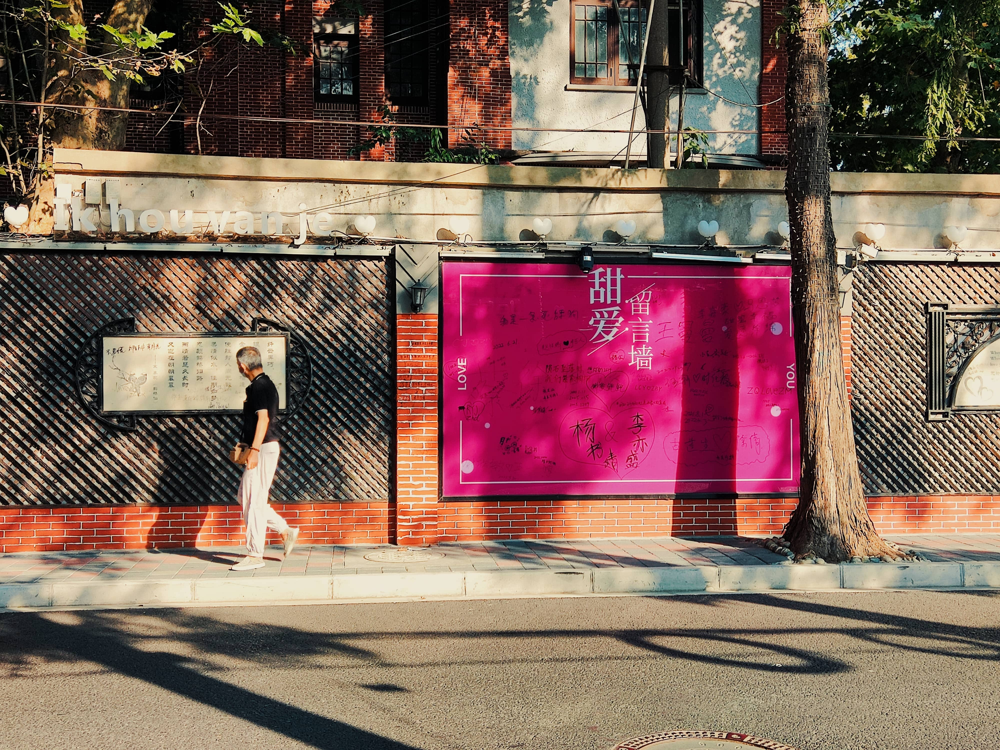

> “很多人会好奇，为什么有的人能够在社交中这么自信地释放自己的魅力呢？”  
> “直到你认真地观察一朵花，它绽放的时候是完全展开的；它的花瓣、花蕊不管多么的脆弱——甚至是慌乱的，它都会把自己完全暴露在世人的面前。这就是它最美好的样子。”

未来的阿巛：

你好，这个月过的有点漫长。回顾下，发现遇见和做了很多很多事情，挺想和你分享分享的。

## 国庆拍照

先给阿巛看看我国庆一组拍的照片吧，我都超级超级超级满意，都感觉不是自己拍的哈哈哈哈。

​​

> 1933老场坊：简直是暗黑摄影圣地，拍了很多很好看的照片，感觉在这里拍照特别能锻炼我的拍照能力，呆了一上午，拍照能力感觉上了一个台阶！现在觉得拍照就应该学会**拍线条**、学会**拍局部**的东西，而是眼睛看见什么就拿出手机拍，**想在照片装的东西越多就越难拍的好**！

​

​

​

​

> 甜爱路：上海「最浪漫」的路，很多情侣在这里留下爱情宣言，不过也有很多人会恶搞，写明星、名人的名字，比如马云❤刘强东之类的哈哈哈哈。

## 上课：两门生信课学到很多

我认真的完成了生物信息学两门的作业，复旦这里的两门生信课真的都很不错。《组学》讲python、算法、深度学习，《实用生物信息学》讲R、讲差异基因分析。这个月的作业里，《组学》我主要花时间做Python实现序列比对算法中的Needleman-Wunsch和Smith-Waterman算法和Python计算PSSM，这两篇都发了博客，其中python计算序列比对算法，还封装好了代码，上传到了pypi中。真的成就感满满，可惜《组学》后面讲深度学习的卷积神经网络和LSTM神经网络我就没有时间听课，以及做作业了，，这门课真的好干！《实用生物信息学》由于报了这课，所以就依旧每门课都不拉下，不过确实讲的很基础都是自己会的东西，但老师讲的很好很好，就当作增强基础了，作业完成了《实用生物信息学第1次作业》 差异表达基因分析报告。

话说，目前来说，复旦脑转化这里的课我其实都不太听的进去，因为很少老师会讲基础的东西，都是讲自己的研究基础，对不懂的人一点都不友好，就很不想听，也不像这两门会布置作业。其实我是很想听的，但总是有这样那样的事情，导致我压根没有心情去听。

## 第一次做JC

月初还做了《神经科学交叉与转化》这门课的JC，这是我研究生以来第一次做JC吧，所以花了很多时间读文献，还去了解背后的作者其他文章。不过对读文献这件事还是不够擅长，虽然文章很简单，还是花了四个整天的时间去读，还经常读到凌晨2点钟，哎！还好做JC的时候封校管控，导致线上开腾讯会议，使得我可以PPT开演示者模式，看着稿子讲哈哈哈哈哈……当然拉，还是希望未来的阿巛不再畏惧做JC，更擅长做JC。研究生的同好们，闲暇时候都在读文献，就好像当小说读一样，我貌似还是没养成这样的习惯，会看思源笔记的更新、会刷酷安、刷八卦，每天好像除了做实验、写代码之外，闲暇时间就都花在弹尤克里里和其他娱乐活动上了。

## 第一轮轮转结束，第二轮开始

这个月第一轮倪老师的轮转总算还是结束了（2022年10月17日结束），第二轮轮转去的李博老师那里。先讲讲在倪老师那里的体验吧，很痛苦，觉得他那边的实验室工作内容很乏味，养小鼠，打病毒，解剖取组织，揭肌肉，显微镜观察荧光表达，顶多再加一个单细胞分析。我觉得很无聊，可以一眼望见头的东西，就是神经有没有投射，我觉得不能发挥出我的长处，第一轮轮转报告我花了接近一周的时间来写，写的非常非常折磨。第二轮李博老师这呢，他是直接给我分配一个三光子ROI成像的课题，简称为3PM-AES，主要就是用matlab开发一个可以操控AWG控制激光器开光的软件，实现ROI的深层成像。其实不难。第一周，我用matlab写m文件直接控制AWG输出，用示波器确认信号，时间主要花在理解AWG是什么；第二周，了解matlab基础语法，用App Designer编写GUI程序，实现GUI控制AWG的简单输出。接下来，就慢慢要进入正轨，做实际的事情了，希望自己能再接再厉，不畏难吧，好好把这个项目给finished掉。李博老师的意思是这个东西之后是打算发文章的，我还有可能和沙沙师姐共一，我心里还是很开心很开心的，因为真的很想要也发一篇文章出来。如果没有意外，我大概是留在李博老师这里了，不知道未来的阿巛是不是已经在李博老师实验室大放光彩了呢？

## 关于剪抑郁症视频把我搞抑郁这件事

学术规范与科研伦理的课程，却让人剪一个抑郁症的视频，还得全班人一起做一个视频，🤣完全不可实操嘛。后来几个组长讨论了下，改成了前面八个小组成员制作寄语图片，最后一个小组负责配音。没错，我就是最后那个负责写文稿、配音、剪视频的冤大头组长。我觉得做这个视频是我这一周不开心的主要根源。

写脚本，就纠结了很久，一直都不知道怎么起笔，我个人想法写的太多，就变成个人作品，而不是整个班的作品了，纠结来纠结去，还是让稿子尽可能抄袭别人的，自己在开头和结尾加点自己的私货，中间部分就是放一百多个人每个人都制作的图片了。这样我达成了自己的创作欲，也没影响到大家想法的表达。

想做的好点，就得共情，于是阿巛同学也就真的假性抑郁一周了，呜呜呜X﹏X。

但是成果我非常非常满意，真的没想到这个视频我会做成这样。

<iframe src="https://player.bilibili.com/player.html?aid=647214297&amp;bvid=BV1te4y1t7w4&amp;cid=877438579&amp;page=1" data-src="//player.bilibili.com/player.html?aid=647214297&amp;bvid=BV1te4y1t7w4&amp;cid=877438579&amp;page=1" scrolling="no" border="0" frameborder="no" framespacing="0" allowfullscreen="true" style="height: 381px;"></iframe>

记录下技术细节

* 稍微了解了下PR的调音，然而还是瞎调音
* 结尾的成员滚动表是用PS制作成图片，拉关键帧实现滚动动画的。

## 关于爱情

这个月其实和陶礼的关系有拉近一点吧，现在和她的关系也仅仅是见面了会打招呼，独自碰见会聊会天，如果周围有人的话，就不怎么搭理对方的关系。哎，先前因为看到她和樊嘉诚走的很近，上课总是坐在一起，下雨还一起撑伞，就很吃醋，导致对她的好感骤降，直接和她说如果她喜欢他的话我就保持距离了，她是苦笑的和我说是我想多了和樊只是同门关系。后来又发现，她的位置是每次樊嘉诚或者他们俩相互之间是会帮忙占位置的，而她明明知道我想坐在她旁边的，我那天下午也明确说了想坐在她附近，却不和我提前说，这点让我很生气很生气，那天晚上上课我没有主动和她打招呼，下课了明明有机会和她一起走也故意拖延让她自己走。我承认拉，是我自己太敏感，太爱胡思乱想，总是不愿意相信别人会喜欢我，总是觉得别人只是在利用我，但她也确实对我的态度特别的含糊，我说暧昧的话从来都是发逃跑的表情包不明确说接受不接受，约她吃饭也是发表情包，就有点搞不懂到底只是把我当工具人。哎，自己确实不适合谈恋爱吧，和人暧昧从来没有成功的。

我目前还是反思下，问题还是在我，对她太认真的，其实并没有那么喜欢她，但扪心自问，我对她很好。这样子就会有期待，但她只是内敛地反馈我，我搞不懂她是把我当同学，还是当朋友，对我有没有好感。说到底，我还是自卑，害怕受伤，于是当别人的表现不那么符合我的幻想的时候，我就会缩进乌龟壳里。这种处事态度，无论是爱情，还是友情，我一直都是这样的，宁愿觉得别人讨厌我，也不相信别人喜欢我，明明别人已经释放友好的信号了，我还是害怕这是陷进，依然往后退。所以我发现我得问自己一个问题了：**别人喜不喜欢我真的重要嘛，重要的难道不是你愿不愿意和人相处，和别人相处快不快乐嘛**，为什么要害怕受伤而躲起来呢，为什么要害怕让别人不开心呢，不应该是怎样做让自己开心，做自己想做的事情，说自己想说的话，就算受伤有咋样，伤口又不是不会愈合，你这样躲起来，留下的遗憾只会让你在一次次深夜反刍，留下一直不会愈合的伤疤。

哇，总算是相通了，以后和陶礼相处就暂时当异性朋友相处吧，因为我如果没有那么喜欢她，也不需要假装很喜欢她，导致自己很难受，还是先当朋友相处看看，确实觉得心动再说。

## 一些折腾

由于在李博老师那，一个人写代码，就有了一些时间摸鱼了。

### 丢弃语雀拥抱Hexo

由于语雀定价策略更改，意识到博客数据还是把握在自己手里好，于是又捡起了Hexo博客，还很幸运发现了Stellar主题。懂吗，就是“一见钟情，再见倾心”的感觉！非常非常喜欢这个主题，种种特性都很满意！近期动态调用的是GitHub issue，以后阿巛同学就用issue发动态了，支持图片，支持markdown，支持标签，支持搜索，还支持基友评论，呜呜，这不是理想的碎碎念天堂嘛！话说刚捡起Hexo，就遇见一个大佬主动要我的友链哈哈哈，还很热心的帮我解决Hexo建站问题，很感恩！

​

### 爱上quarto

quarto， https://quarto.org/

真的不愧为下一代rmarkdown。我觉得quarto比rmarkdown强的地方在于把生态给大一统了，你甚至都不需要r环境，真的像一个桥梁工具。

* 不仅仅可以写代码r、python，与jupyter相互转化，导出GFM规范的markdown
* 还可以把md当成稿子，写latex报告，写word，做ppt
* 文档很详细，对vscode也很友好。
* 离谱的是它还能做个人博客，强无敌。不过我已经入了hexo的坑就暂时不逃离了。

那思源怎么和quarto搭配呢，前面已经说了，quarto适合当个桥梁，把md转换为latex，word，ppt，可以自定义模板，你如果不用它写代码，也可以当成加强版的pandoc。毕竟思源虽然能导出pdf和word，但样式基本上是不能直接拿去交的，很不规范，也不支持引用文献。quarto则可以快速把md导出成超级规范的文档，如何自定义word和ppt模板和选择引用文献样式我以后会写博客，关于quarto网上的文章目前还比较少（那下次我的博客标题就可以是全网首发了[受虐滑稽])，但相信我，用了它之后，你会发现markdown的新天地。
