> 凡事先从自己身上找原因，这是理性，凡事只从自己身上找原因，这是奴性。

未来的阿巛：

Hi！

这个月过的感觉好漫长好漫长呀！感觉自己这个月做了很多很多事情，瞬间成长了很多！也开始逐渐适应这边忙碌的研究僧生活了。

## 关于轮转：繁忙的第二轮轮转结束、第三轮轮转开始

先说轮转的事情吧，李博老师这里的轮转我的任务主要就是做一个控制三光子显微镜进行ROI imaging的GUI，不过轮转时间有限，只是在虚拟的环境里完成初步的GUI demo。整个轮转过程中呢，其实挺累的，每周二都要工作汇报，每周还有一个大组会。轮转时，我基本都是周一以及周二早上得疯狂赶PPT。但这个过程，也不得不说，一定程度上提升了我做ppt和pre的能力。另外值得一提的是，虽然用Matlab 开发GUI，但我感觉我对matlab还是不太熟悉哈哈哈，只是了解大概的基础语法，但是对Matlab了解不深，很多矩阵、图片处理函数都是得上网去查。我已经打算留在李博老师这里了，目前猜测之后也走偏赵师兄的路子吧，今后有时间还是得多学习图像处理和神经光学成像的知识。第三轮轮转找的袁鹏老师，目前他就丢给我一个小鼠滚轮，就不管我了，自己在尝试入门Unity当中，想想自己第一轮做实验，第二轮用Matlab，第三轮用C\#，真的挺有趣的哈哈哈哈。

先前看到这样一句话。

> Any fool can write code that a computer can understand. Good programmers write code that humans can understand

其实我愈发觉得，如果只是做纯生信分析的话，是很容易被人取代的，因为你只是用别人的代码分析自己实验室的数据，生信只要花上一点时间还是很容易上手的，我如果真的研究生打算走代码方向，还是尽量研究算法，要让自己的工作没那么容易被外行人搞懂上手。

## 一些反思

### 时间管理

这个月用滴答清单进行时间管理更加顺手了，一般都是用周视图来管理事项。

其实我必须得承认，自己的做事效率并不高……

这个月发现的一个问题在于，我会很喜欢和别人比花在学习和轮转上的时间，如果别人学习的时候，我在放松，我就很有罪恶感……但，真的，应该比的是效率，我应该努力提高自己的效率，一件事情，怎么把它又快又好做好，而不是总是磨呀磨呀，一直折腾自己到凌晨一两点……

另外，不要给一件事情太多时间，我有一个倾向，给了多少时间，就会花多少时间。这个好像就叫帕金森法制（不是帕金森病orz）。

​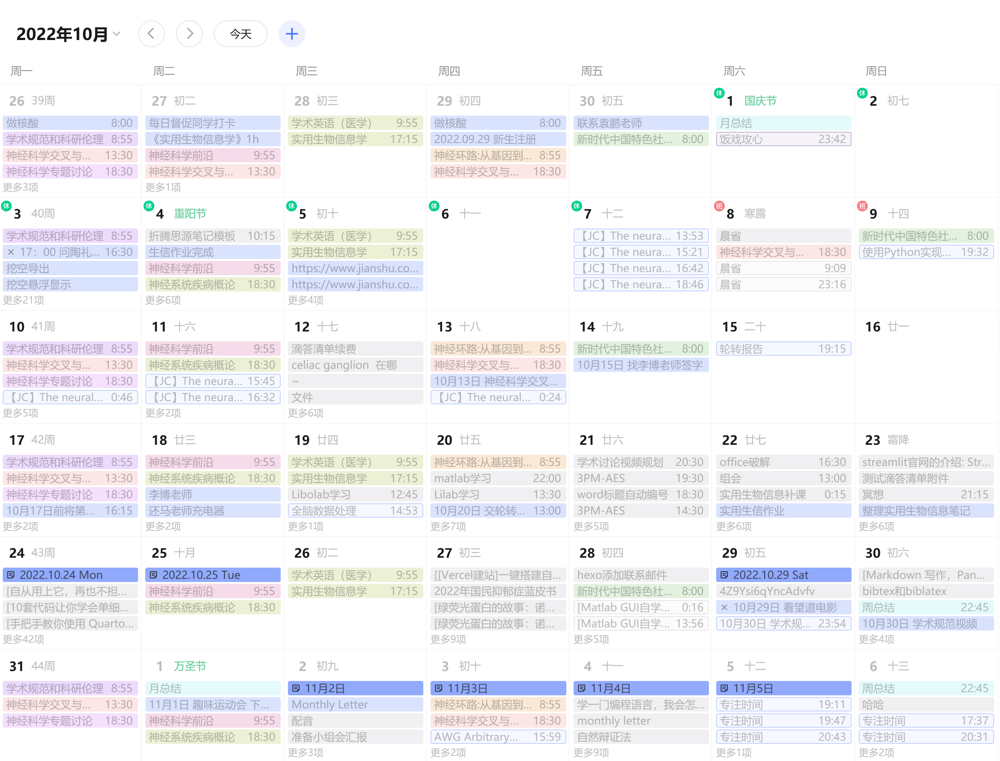

​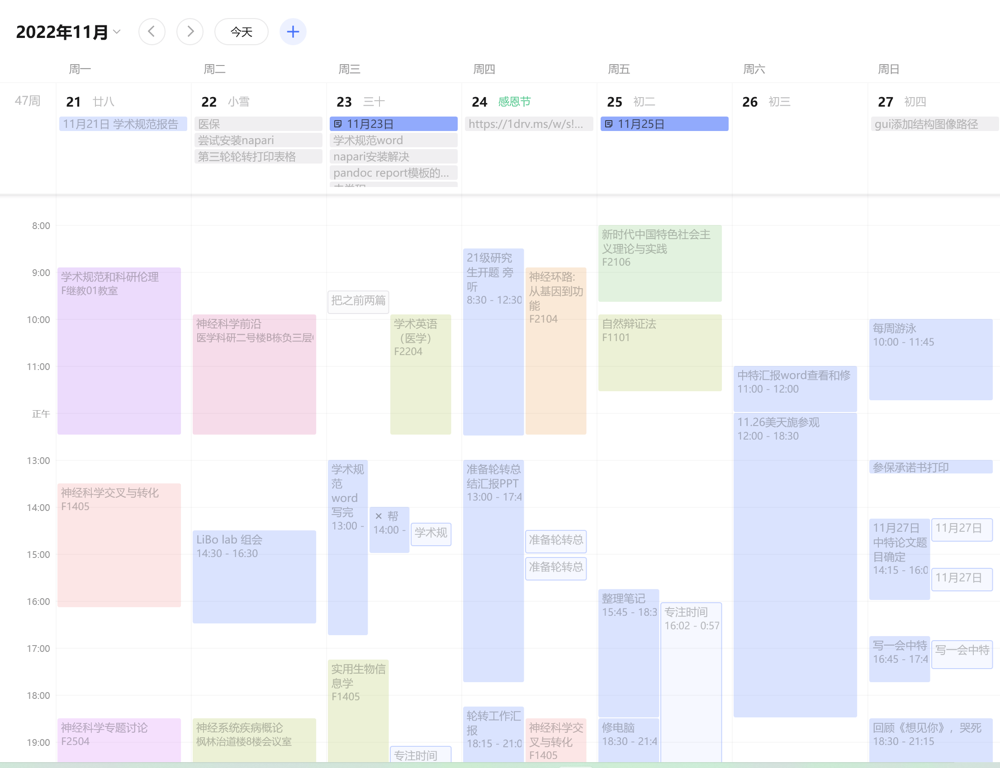​

### 独立思考

来到复旦之后，我最大的感慨是，大家都好会在课堂上问问题呀，在这里待久了，貌似自己的思考能力也有一定的提升，不过常常还是记在笔记本里，没有和人讨论。

我总是这样，总是闭门造车。就算有了问题，也很少真的会和人讨论，打破砂锅问到底。什么时候，阿巛才能成为能侃侃而谈的人呢。

另外，虽然自己的presentation有所长进，但还是不如别人，做不到不看ppt面对观众prr，做不到不背稿子pre。阿巛还有很长的路要走呀

### 广阔的胸襟

> 凉风有信，秋月无边，亏我思娇的情绪好比度日如年，虽然我不是玉树临风，潇洒倜傥，可是我有我广阔的胸襟，强健的臂弯！
> 金刚怒目，不如菩萨低眉

《青蛇外传》，里面有两个让我特别打动的点，貌似让最近不开心和迷茫的我，稍微释怀了。

* 情欲会让人失去理智，学会放下欲望
* 要持有慈悲心，放下怨恨心

## 一些小确幸

### 买了新电脑

这个月初，趁着双十一，买了新电脑，联想thinkbook14+（pdd买的，4700入手锐龙R7-6800H版本），用笔记本电脑的体验++。先夸夸这台机子的好处吧

* 充电速度很快，大概1h内能充满；
* 续航好，把电源计划改为平衡之后，续航能有6h+；
* 屏幕支持180°展开，观看更自由，更好搭配电脑支架；
* 颜值高，全金属，自动贴上透明磨砂的膜之后我更爱它了！
* 联想电脑管家支持修改开机动画，改成了超级玛丽哈哈哈；
* 键盘按键比较舒服，现在再也不用像之前dell 灵越 5480那台一样，非要用外接键盘了；

### 博客重新开始

上个月，由于语雀收费策略更改，意识到博客数据应该在自己的手中。又奔入hexo的怀抱，而且改成了stellar这个各方面都很符合我心意的新主题。

目前一些碎碎念也会在博客上发，由于比较忙，差不多每两周会写一篇博客。

这个月就主要写了两篇关于markdown输出word和ppt的

* [设置word模板，Markdown 也能自动转换为美观规范的 Word 文档 - Achuan-2](https://www.achuan-2.top/posts/bc4b56d9.html)
* [Quarto：Markdown 又何必只是 Markdown - Achuan-2](https://www.achuan-2.top/posts/50f47788.html)

> ps：目前写报告，已经基本会用quarto来导出markdown笔记为word和pdf了，word模板在慢慢完善，pdf主要是拿来交对格式要求特别严格的课程作业，比如生信分析报告之类的。
>
> 再ps：我写报告，没有别的长处，要说有就是特别爱引用吧哈哈哈哈，之所以喜欢用quarto的一方面原因也是引用文献生成脚注特别方便。

## 本月的一些图片

2022.11.01 趣味运动会，主要项目有拔河、国王躲避球项目，小组拿了第一名。  
​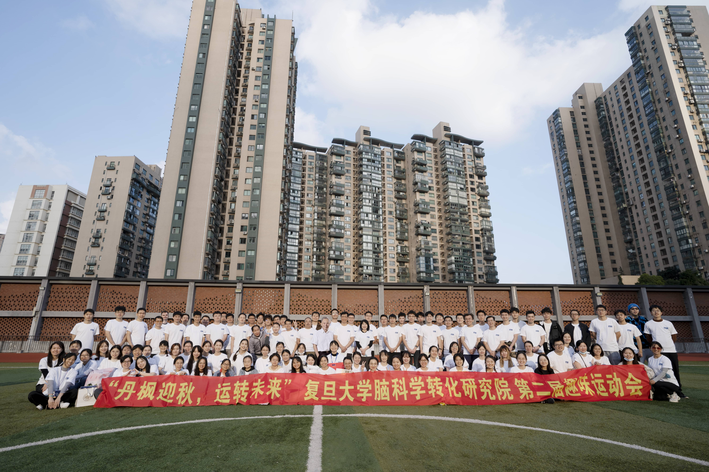​

​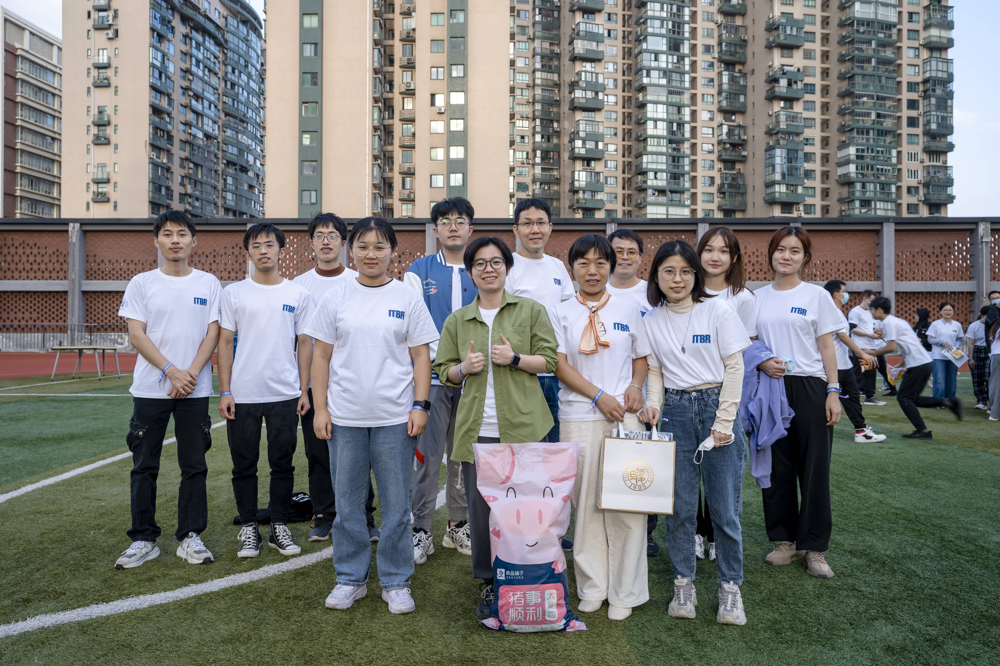​

2022.11.13 第一次去枫林游泳馆游泳，已经坚持三周每周日都去游泳啦

​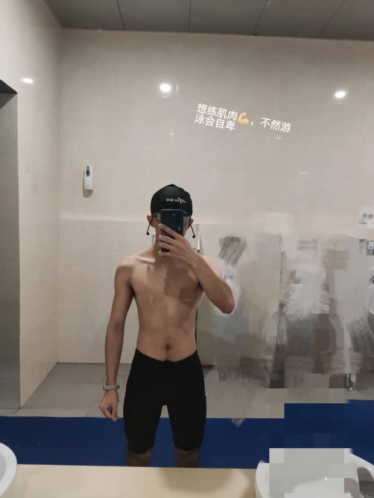​

2022.11.16 团日活动去上海科技馆，有机会还想再去。第一次射箭，第一次摸等离子球。

​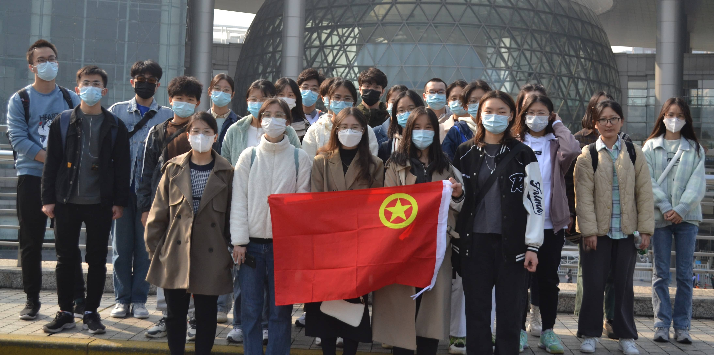​

​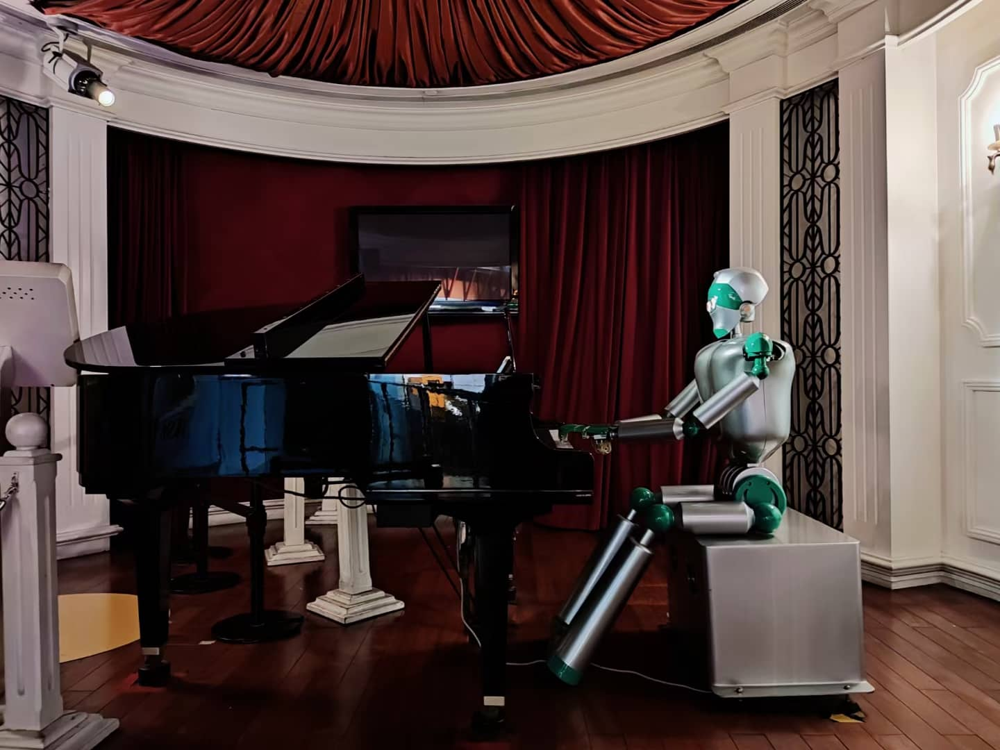

​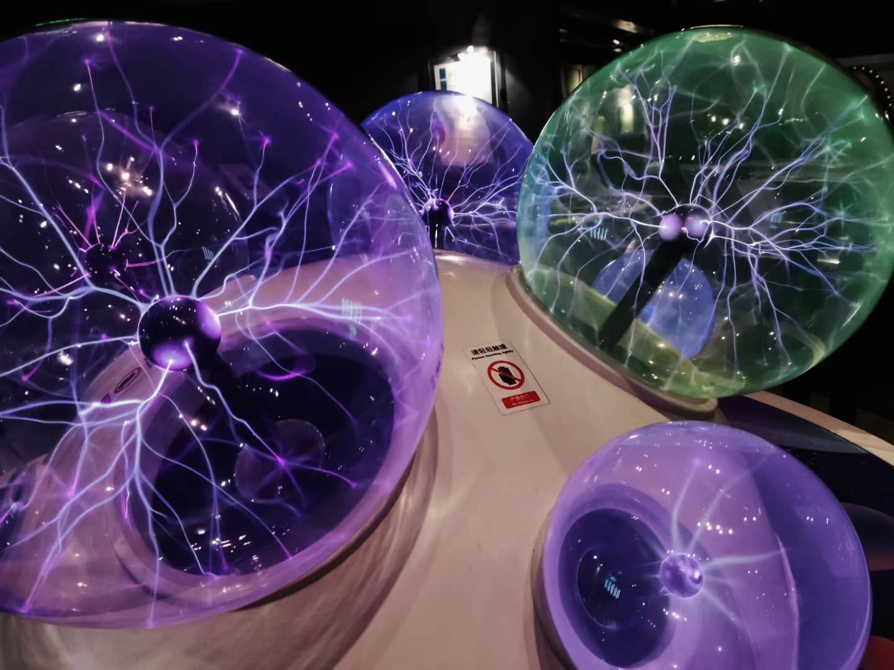​

2022.11.20 和韩薇一起听陈绮贞歌迷路演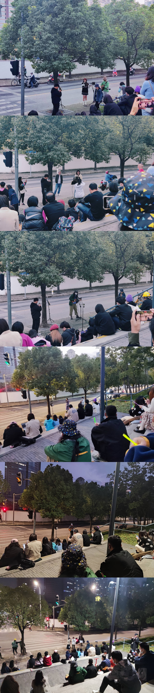​

‍

​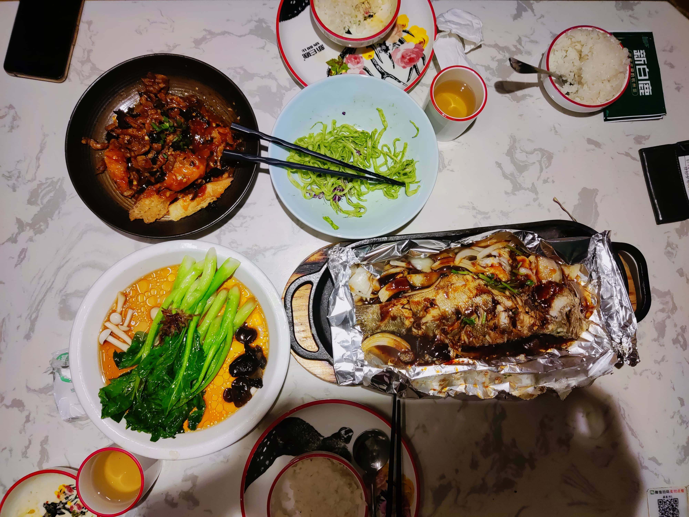​

2022.11.26 参观美天旎公司

​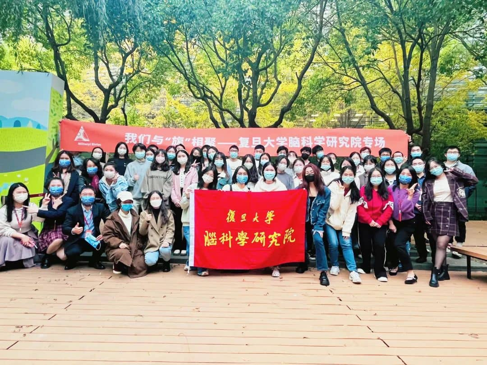​
​

2022.11.28 重温植物大战僵尸

​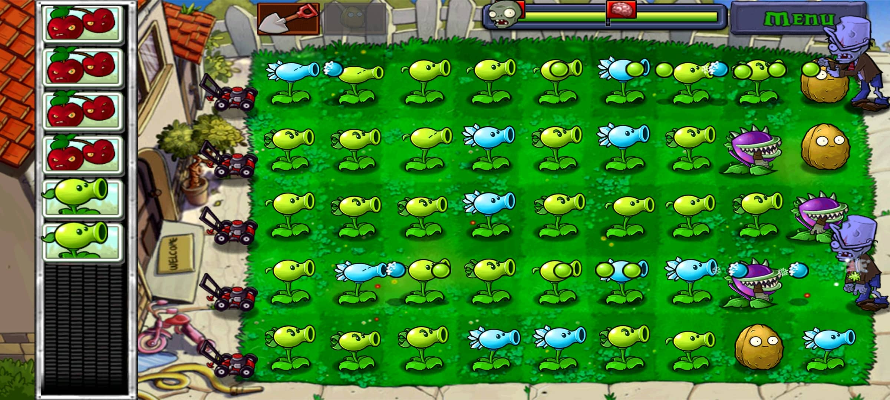​

‍

## The end

下个月再见

from 2022.12.03的巛

